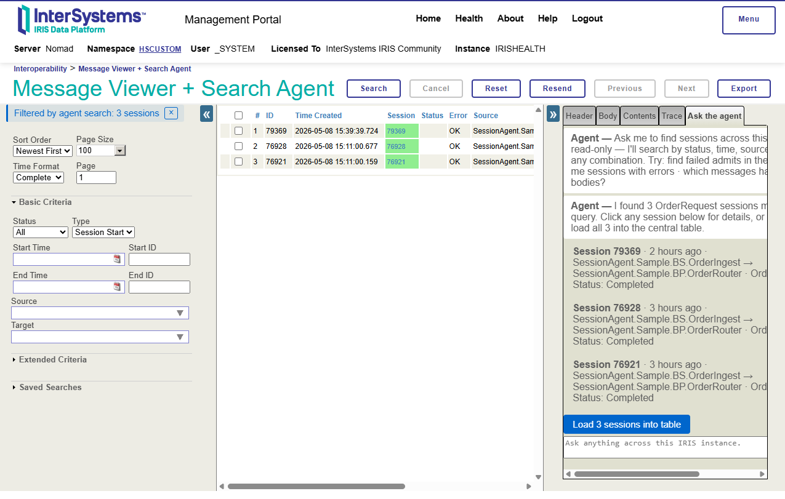
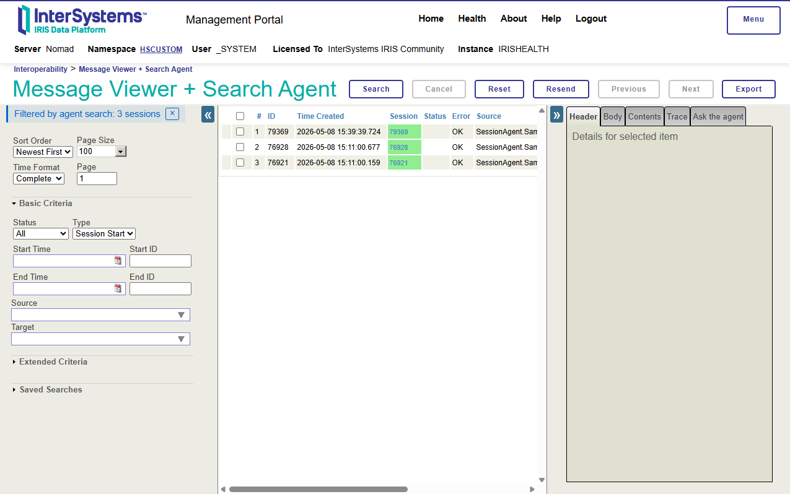
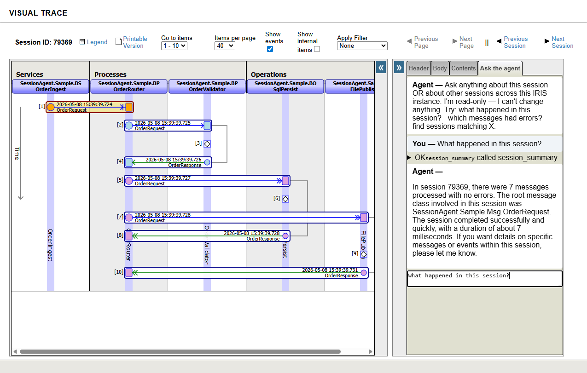
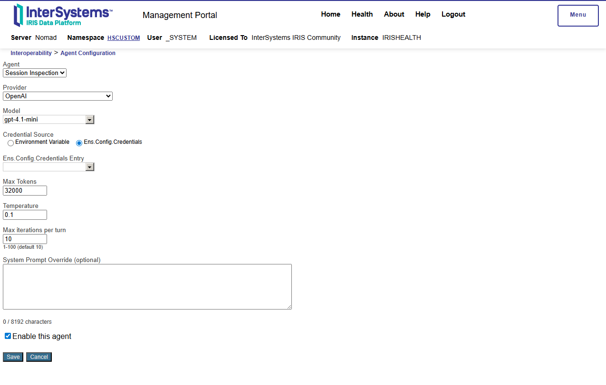

# iris-session-agent

> [!NOTE]
> **v1.0.0 is feature-complete (Epic 10 closed 2026-05-07).**
>
> Both agents (Session Inspection + Message Search) ship working end-to-end; the search-to-inspection hand-off (Devin Journey 2) is empirically validated against a live sample-production scenario; vocabulary capture (Story 9.x) operates silently on operator click-through; sweep tasks (Story 10.6) keep the audit + chat-history footprint bounded; the vendored Markdown bundle (Story 10.7) renders citations + code blocks against a fresh-tab CDN-blocked browser; and the FR59 cross-matrix gate (23 tools × 4 providers = 92 combinations) clears in **mock-mode 92/92** (15.6s) AND **live-mode 92/92** against OpenAI + Anthropic + Gemini + OpenAI-compatible endpoints (run 4, 342.6s elapsed; runs 1–3 surfaced and resolved a Gemini key-rotation event + a fixture-format hardening + one transient Anthropic mid-flight retry — all documented in the Story 10.9 walkthrough). See [`_bmad-output/implementation-artifacts/10-9-prd-v1-completion-validation-walkthrough.md`](_bmad-output/implementation-artifacts/10-9-prd-v1-completion-validation-walkthrough.md) for the verbatim walkthrough.

> *"v1 is feature-complete. Both agents work, the hand-off works, the vocabulary captures silently, all 10 epics integrate cleanly. Next is Epic 11 — and the operator can already pilot today."* — Joshua Brandt, maintainer (release notes self-quote, 2026-05-07)

An open-source InterSystems IRIS module that adds an AI assistant chat experience to the Interoperability operator's existing Management Portal. Two agents share infrastructure inside one IPM-installable package and run on **IRIS / IRIS for Health 2024.1+** in pure ObjectScript — no embedded Python in the runtime path, no AI Hub dependency.

> *"Chatting with your Interoperability Session to really understand what happened — and finding the right session by asking."*

## Quick start — using the agents

Two agents that read your Ensemble sessions and answer questions in plain English. The **Search Agent** finds the sessions you care about by natural-language query (no SQL); the **Inspection Agent** chats about a specific session you've selected, reading across the six message-trace surfaces (`Ens.MessageHeader`, message bodies, search-table extents, `Ens.Util.Log`, `Ens.Rule.Log`, BP runtime state) and citing what it sees.

**Try these prompts** against the [sample interoperability production](#sample-interoperability-production-for-testing) (run a few `RunScenario(...)` calls first):

- On the **Message Viewer + Search Agent** screen — *"Find sessions with errors in the last hour"* — the Search Agent narrows the table to matching sessions and offers a "Load N sessions into table" button so you can keep investigating.
- On the **Visual Trace + Inspection Agent** screen — *"Why did this session fail?"* — the Inspection Agent reads the rule log, event log, and message headers in parallel and answers with citations back to the underlying rows.
- On either screen — *"Show me the source of the OrderRouter business process"* — the Inspection Agent's BP-introspection tools surface the routing rule + class definition.









### Launching the agents

The custom Search and Inspection screens do **not** appear as new menu entries in the Mgmt Portal nav — they replace the standard Message Viewer and Visual Trace pages from the Mgmt Portal breadcrumb. Two ways to reach each one:

- **Search Agent (Message Viewer screen):**
  - Direct URL: `http://<host>:<port>/csp/<lower-namespace>/SessionAgent.EnsPortal.MessageViewer.zen` *(bookmarkable)*
  - Mgmt Portal breadcrumb: `Interoperability → Message Viewer + Search Agent`
- **Inspection Agent (Visual Trace screen):**
  - Direct URL: `http://<host>:<port>/csp/<lower-namespace>/SessionAgent.EnsPortal.VisualTrace.zen?SESSIONID=<id>` *(bookmarkable; pin the URL with a specific session id to land on a known incident)*
  - From the Search Agent screen: clicking a session-ID badge in any agent reply opens that session in the custom Visual Trace screen (Story 12.3 fix — session-ID links route through the SessionAgent VisualTrace, not the standard one).

For HealthShare deployments the path includes `/healthshare/` between `csp/` and the namespace — see [§ "8. Bookmark URLs"](#8-bookmark-urls) for the full pattern.

## v1.0.0 scope-complete summary

| Capability | Story / Epic | Operator-observable surface |
|---|---|---|
| Session Inspection agent (read-only Ens.* introspection) | Epic 4 (13 tools) | VisualTrace chat tab |
| Message Search agent (10 search tools + vocabulary) | Epic 8 (10 tools) | MessageViewer chat tab |
| Search → Inspection hand-off ("from search" stripe + click-through context) | Epic 10 (Stories 10.1–10.5) | Visible stripe in inspection chat after click-through |
| Silent vocabulary learning (per-user alias capture) | Epic 9 (Stories 9.2–9.5) | `vocab_lookup` tool surfaces saved aliases; sweep keeps the table bounded |
| Sweep tasks (audit + chat-history retention) | Epic 7 + Story 10.6 | Mgmt Portal Task Manager (`SessionAgent.PurgeOrphanedChatHistory`, `SessionAgent.PurgeStaleSearchChatHistory`, `SessionAgent.UserVocabularyDecay`) |
| Vendored Markdown bundle (citations + code blocks render under CDN-blocked browsers) | Story 10.7 | `<script src="markdown-bundle.min.js">` ships with the module |
| FR59 cross-matrix gate (23 tools × 4 providers = 92) | Story 5.4 + 8.x + 10.9 | `SessionAgent.Test.ToolCallRoundtripIntegrationTest` (mock + live) |

## Try it in a clean namespace (recommended for evaluation)

If you want to evaluate iris-session-agent without touching your main `HSCUSTOM` namespace, this is the linear end-to-end recipe. Substitute `SATEST` with any namespace name you prefer; commands are run from the `%SYS` shell unless noted.

1. **Create the namespace** (interop-enabled). From the Mgmt Portal: *System Administration → Configuration → System Configuration → Namespaces → Create New Namespace*. Set the name (e.g., `SATEST`), assign a database (a fresh one is fine), and tick **"Make this an interoperability-enabled namespace"** so `Ens.*` tables are projected.

2. **Map the `SessionAgent.PKG` package** from the source database (typically `HSCUSTOM`) into the new namespace:

   ```objectscript
   %SYS> Set props("Database") = "HSCUSTOM"
   %SYS> Set sc = ##class(Config.MapPackages).Create("SATEST", "SessionAgent", .props)
   %SYS> If 'sc Write !,$System.Status.GetErrorText(sc)
   ```

   See [§ "Multi-Namespace Install"](#multi-namespace-install) step 2 for details and substitution rules.

3. **Run `InstallIntoNamespace`** to wire the audit events, RBAC role grants, sweep tasks, and the per-namespace `Config.Agent` seed rows:

   ```objectscript
   USER> Set sc = ##class(SessionAgent.Installer).InstallIntoNamespace("SATEST")
   USER> If 'sc Write !,$System.Status.GetErrorText(sc)
   ```

4. **Wire LLM provider credentials.** Pick at least one provider — OpenAI is the simplest first run. Either set the `OPENAI_API_KEY` env-var visible to the IRIS process, or create the `Ens.Config.Credentials` row in the `SATEST` namespace named `SessionAgentOpenAI` with your key in the `Password` field. See [§ "6. LLM provider API keys"](#6-llm-provider-api-keys) for the canonical credential names per provider and the env-var fallback rules.

5. **Configure the agents.** Browse to `http://<host>:<port>/csp/satest/SessionAgent.UI.AgentConfig.zen`. The form lists both agents (`session-inspection` and `message-search`); for each one set `Provider` (e.g., `openai`), `Model` (e.g., `gpt-4.1-mini`), tick `Enabled`, and `Save`. The form runs against the *namespace you opened it in*, so the saved values are scoped to `SATEST` only.

6. **Install the sample interop production.** From a `SATEST` terminal session:

   ```objectscript
   SATEST> Do ##class(SessionAgent.Sample.Bootstrap).InstallProduction()
   SATEST> Do ##class(Ens.Director).StartProduction("SessionAgent.Sample.Production")
   ```

7. **Generate sample sessions.** Each `RunScenario` call produces one fresh `Ens` session id with a different failure shape (see the [scenario-mode table below](#sample-interoperability-production-for-testing)):

   ```objectscript
   SATEST> Do ##class(SessionAgent.Sample.BS.OrderIngest).RunScenario("none")
   SATEST> Do ##class(SessionAgent.Sample.BS.OrderIngest).RunScenario("businessProcessFailure")
   SATEST> Do ##class(SessionAgent.Sample.BS.OrderIngest).RunScenario("businessOperationFailure")
   SATEST> Do ##class(SessionAgent.Sample.BS.OrderIngest).RunScenario("partialSuccess")
   ```

8. **Launch the agent UI.** Open `http://<host>:<port>/csp/satest/SessionAgent.EnsPortal.MessageViewer.zen` to drive the Search Agent against the new sessions, then click any session-ID badge to hand off into the Inspection Agent on the Visual Trace screen. See [§ "Quick start — using the agents → Launching the agents"](#launching-the-agents) for both URLs.

9. **Tear down when done** (optional). Stop the production, uninstall the sample classes, and drop the namespace if you no longer need it:

   ```objectscript
   SATEST> Do ##class(Ens.Director).StopProduction()
   SATEST> Do ##class(SessionAgent.Sample.Bootstrap).UninstallProduction()
   ```

   Dropping the namespace itself is a Mgmt Portal step (*System Administration → Configuration → System Configuration → Namespaces → SATEST → Delete*); the audit + chat-history rows live inside the namespace and are removed with it.

This entire recipe takes ~10 minutes on a fresh IRIS 2024.1+ install once the [Operator Prerequisites](#operator-prerequisites) below are in place (IPM, Web Gateway timeout, RBAC, package mapping, API key, SSL/TLS, daily purge task — they apply once per IRIS instance, not once per namespace).

## Operator Prerequisites

Before installing this module, complete the following on your IRIS instance. Most operators finish all eight steps in under 30 minutes. Each step is independent — you can do them in any order, but the install will fail or behave unexpectedly until they are all in place.

### 1. Supported IRIS versions

IRIS / IRIS for Health **2024.1 or later**. The agent runtime is pure ObjectScript; no embedded Python is required on the IRIS host.

### 2. IPM (InterSystems Package Manager) availability

This module is distributed via IPM (`zpm`). IRIS does **not** include IPM by default in user namespaces — even on IRIS for Health 2024.1+, where a developer-mode IPM ships in the read-only `HSLIB` namespace, the module's target namespace (typically `HSCUSTOM` or your interop namespace) starts with **no IPM available**. One-time setup, run once per IRIS instance:

**Step 2a — Install IPM into `%SYS`** *(skip if `zpm version` from `%SYS` already reports a version)*

From the `%SYS` shell:

```
Do $System.OBJ.Load("https://pm.community.intersystems.com/packages/zpm/latest/installer","ck")
```

This loads the canonical IPM bootstrap from the InterSystems community package repository, compiling all `%IPM.*` classes into `%SYS`. Verify with `zpm version` — should report a 0.10.x or later version.

**Step 2b — Enable IPM across your namespaces**

Still from the `%SYS` shell:

```
zpm "enable -map -globally"
```

This maps the `%IPM` package and `%IPM.*` routines from `%SYS` into every non-system namespace (HSCUSTOM, HSSYS, USER, etc.). Without this step, `zpm "load /path/to/iris-session-agent"` fails with `<CLASS DOES NOT EXIST>DisplayError *%IPM.Repo.UniversalSettings` during the install lifecycle's Configure phase, because the phase context-switches into the install target namespace where the `%IPM.*` classes weren't visible.

After Step 2b, verify by running `zpm version` from your target namespace (e.g., `HSCUSTOM`) — should report the same version as `%SYS`, with `Installed In: %SYS` indicating the mapping is active.

### 3. Web Gateway timeout

The Web Gateway's default **"Server Response Timeout"** on a fresh IRIS 2024.1+ install is **`60` seconds** (verified on IRIS for Windows 2025.1 — see [Story 1.2 Task-0 probe](_bmad-output/implementation-artifacts/1-2-web-gateway-timeout-task-0-probe-readme-operator-prerequisites.md#task-0-output) for the live capture). LLM-call latencies often sit in the 30–90s band, and an agent turn typically chains 2–3 tool calls plus one LLM round-trip — the 60s default kills these mid-stream. **Raise it to `300` seconds before installing.**

Navigate to the Web Gateway management page (typically `http://<host>/csp/bin/Systems/Module.cxw`) and follow this path:

```
Web Gateway management page
  → Login (CSPSystem account)
  → Configuration  (left-nav section)
  → Default Parameters
  → "Connections to InterSystems IRIS" group
  → Server Response Timeout:  60   →  change to  →  300
  → Save Configuration
```

The 300s value gives a 90s per-call cap × 3-tool-call agent turn comfortable headroom — see [PRD NFR-P1](_bmad-output/planning-artifacts/prd.md) and the [architecture timeout-cascade rationale at architecture.md line 1131](_bmad-output/planning-artifacts/architecture.md) (Web Gateway 300s prereq ↔ 90s per-call cap ↔ max-iter 10).

### 4. RBAC

The module installer creates the **`SessionAgent_ReadOnly`** role automatically with `SELECT`-only grants on `Ens.*` tables (this role install ships in [Epic 1 Story 1.4](_bmad-output/planning-artifacts/epics.md)). After install completes, assign this role to the IRIS user that the portal user maps to (typically the same user — verify via Security Management).

### 5. Package mapping

Map `SessionAgent.*` from `HSCUSTOM` to your interoperability namespaces (or `%ALL`):

```
Management Portal
  → System Administration → Configuration → Namespaces
  → <target NS> → Package Mappings → Add: SessionAgent.*  ←  HSCUSTOM
```

### 6. LLM provider API keys

The runtime supports four bundled providers — **OpenAI** (Epic 2), **Anthropic** (Epic 5 Story 5.1), **Google Gemini** (Epic 5 Story 5.2), and **OpenAI-compatible** (Epic 5 Story 5.3 — for local Ollama / vLLM / LM Studio / any compatible endpoint). MVP (Epics 1–4) requires only OpenAI; the other three are operator-optional until you configure an agent to use them via [`SessionAgent.Config.Agent`](src/SessionAgent/Config/Agent.cls).

For each cloud provider you intend to use, wire **one** of the two delivery mechanisms:

- **Environment variable (preferred for container deployments)** — set the variable visible to the IRIS process. Container deployments typically inject these via Docker / Kubernetes secrets:

  | Provider | Env-var name |
  |---|---|
  | OpenAI | `OPENAI_API_KEY` |
  | Anthropic | `ANTHROPIC_API_KEY` |
  | Google Gemini | `GEMINI_API_KEY` |

- **`Ens.Config.Credentials` row (traditional on-prem installs)** — create a credentials row with the canonical `SystemName` the runtime expects, then no further configuration is needed:

  | Provider | `SystemName` (canonical) | `Username` (any non-empty marker) |
  |---|---|---|
  | OpenAI | `SessionAgentOpenAI` | `openai-bearer` |
  | Anthropic | `SessionAgentAnthropic` | `anthropic-bearer` |
  | Google Gemini | `SessionAgentGemini` | `gemini-key` |

  Set the `Password` field to your API key. Resolution falls back from env-var → `Ens.Config.Credentials` row → fail-fast if neither is present (per [`SessionAgent.Util.EnvSecret`](src/SessionAgent/Util/EnvSecret.cls)).

**OpenAI-compatible / Ollama (Epic 5 Story 5.3):** the **full** endpoint URL — including the `/v1/chat/completions` path — goes in [`SessionAgent.Config.Agent.EndpointUrl`](src/SessionAgent/Config/Agent.cls). Examples:

  | Deployment | Canonical `Config.Agent.EndpointUrl` |
  |---|---|
  | Local Ollama | `http://localhost:11434/v1/chat/completions` |
  | Network Ollama | `http://<host>:11434/v1/chat/completions` (e.g., `http://192.168.0.123:11434/v1/chat/completions`) |
  | vLLM behind reverse-proxy | `https://<host>:8443/v1/chat/completions` |
  | LM Studio (default) | `http://localhost:1234/v1/chat/completions` |

  Set `Config.Agent.Provider = 'openai-compatible'`. For default Ollama deployments **no API key is required** — leave `Config.Agent.CredentialName` empty (the provider auto-detects this and omits the `Authorization` header). For paid OpenAI-compatible endpoints (Together AI, OpenRouter, Anyscale, paid Ollama instances behind Bearer auth), wire a credential under any name and reference it via `Config.Agent.CredentialName='YourCredentialName'`. Both `http://` and `https://` schemes are supported (the provider auto-detects the scheme + non-default port from the URL — Ollama's `:11434`, llama.cpp's `:8080`, etc.).

**API keys are never stored inside `SessionAgent.Config.Agent` itself.**

**Cost-effective default models** (per Rule 10 spec-time research, May 2026):

| Provider | Default model id | Input $/MTok | Output $/MTok | Notes |
|---|---|---|---|---|
| OpenAI | `gpt-4.1-mini` | $0.40 | $1.60 | Story 2.4 default; tool-use reliable |
| Anthropic | `claude-haiku-4-5-20251001` | $1.00 | $5.00 | Pricing page recommends Haiku for "simple tasks"; sized for tool-dispatch agents |
| Google Gemini | `gemini-2.5-flash` | $0.30 | $2.50 | Pricing page recommends Flash for agentic reasoning balance |
| Ollama / OpenAI-compatible | `qwen3:14b` | local | local | Per `ollama pull qwen3:14b`; quantized 14B param chat model with tool use |

A dev install can keep its `OPENAI_API_KEY` env-var for local testing AND wire the matching `Ens.Config.Credentials` row — env-var wins; row is the operator-friendly fallback. Production deployments typically pick exactly one mechanism per provider.

### 7. SSL/TLS configuration for outbound HTTPS to the LLM provider

`SessionAgent.LLM.OpenAIProvider` issues HTTPS POSTs against `api.openai.com` (and the equivalent provider hosts in Epic 5). IRIS requires a named SSL/TLS configuration to negotiate outbound TLS. The provider hardcodes the configuration name **`DefaultSSL`**.

If `DefaultSSL` does not already exist on your IRIS install, create a client-side SSL configuration with that exact name. Two paths:

- **Management Portal:** *System Administration → Security → SSL/TLS Configurations → Create New Configuration*. Set **Name** = `DefaultSSL`, **Type** = `Client`, **Min Protocol** = `TLSv1.2`, **Server certificate verification** = `None` (acceptable for outbound calls to well-known TLS termination on `api.openai.com`; tighten to `Require` + provide a CA file in hardened deployments).
- **ObjectScript / SQL:** create with `Security.SSLConfigs.Create("DefaultSSL", ...)` from `%SYS` — see [`irislib/Security/SSLConfigs.cls`](irislib/Security/SSLConfigs.cls) for the full signature.

**How to verify:** from `%SYS`, query `SELECT Name FROM Security.SSLConfigs` — `DefaultSSL` must appear. Without this configuration, every outbound LLM call fails fast with `"OpenAI mid-flight failure (request may have been processed)"` in `Audit.LlmCall.ErrorText` — the symptom is a sub-second turn that returns no answer (no real network call ever happened). The Story 2.12 retro empirical battery surfaced this as a missing operator-prereq documentation gap; this section closes it.

### 7a. System Prompt Override length cap (Story 6.1)

The `System Prompt Override` field (in [`SessionAgent.Config.Agent.SystemPromptOverride`](src/SessionAgent/Config/Agent.cls)) stores up to **8192 characters**; longer prompts are silently truncated by the persistence layer. The Story 6.1 [`SessionAgent.UI.AgentConfig.zen`](src/SessionAgent/UI/AgentConfig.cls) form's char counter warns at 7500 chars (amber) and flags exceedance at 8192 chars (red), so operators see the cap they're approaching instead of silently hitting truncation. A future Story 6.x sibling backend tweak will raise the cap (`MAXLEN=8192` → `MAXLEN=32767`) or convert the property to a stream backing — see the [deferred-work.md "SystemPromptOverride MAXLEN=8192 silent truncation" entry](_bmad-output/implementation-artifacts/deferred-work.md) for the rationale and roadmap.

### 8. Bookmark URLs

After install, both Management Portal entry points are bookmarkable. **Use the URL pattern that matches your IRIS deployment style** — HealthShare-based deployments include the `/healthshare/` segment; plain IRIS deployments do not:

- **HealthShare deployments:**
  - `/csp/healthshare/<NS>/SessionAgent.EnsPortal.MessageViewer.zen` *(Search Agent entry — natural-language session search)*
  - `/csp/healthshare/<NS>/SessionAgent.EnsPortal.VisualTrace.zen` *(Inspection Agent — chat about a specific session)*
- **Plain IRIS deployments:**
  - `/csp/<NS>/SessionAgent.EnsPortal.MessageViewer.zen`
  - `/csp/<NS>/SessionAgent.EnsPortal.VisualTrace.zen`

The Search Agent path is for the operator's "find the session I care about" entry; the Visual Trace path opens the Inspection Agent on a specific session that the operator already has selected.

### 9. Daily purge task

The installer schedules `SessionAgent.Task.PurgeOrphanedChatHistory` to run daily at 02:00 UTC (this task ships in [Epic 7 Story 7.2](_bmad-output/planning-artifacts/epics.md)). Verify it's enabled in **Task Manager** after install. The task removes chat-history rows whose linked `Ens.MessageHeader` session has been purged, so no orphaned conversations accumulate.

## Multi-Namespace Install

By default, the IPM `<Invoke>` install path scopes all install-time work to the **single** namespace named in `module.xml` (typically `HSCUSTOM`). Operators running multiple interop namespaces on the same IRIS instance — for example, a dedicated test namespace, a per-tenant namespace, or a second production interop namespace — can install iris-session-agent into each of them independently using the `InstallIntoNamespace` entry point.

**Architectural decision: `Config.Agent` rows are PER-NAMESPACE.** Each namespace's `SessionAgent_Config.Agent` table is independent — flipping `Enabled=1` or changing `Provider` in one namespace does not affect any other namespace. This is the safer default (no cross-namespace coupling, no operator confusion about which namespace's `Provider` is "the" provider). If you maintain identical config across namespaces today, you re-enter it in each one. A future `CopyConfigBetweenNamespaces(pSrc, pDst)` helper is tracked in `_bmad-output/implementation-artifacts/deferred-work.md` for operators with cross-namespace identical config.

**Operator walkthrough.** Run these steps once per additional target namespace. Substitute `OTHERNS` with the actual namespace name and `HSCUSTOM` with the source database where the SessionAgent.PKG `.cls` files live (the source database that already has the package — typically `HSCUSTOM` if you installed via the IPM `<Invoke>` path).

1. **Identify the target namespace.** It must be an existing **interop-enabled** namespace (i.e., `Ens.*` tables are projected). Create one via the **Mgmt Portal → System Administration → Configuration → System Configuration → Namespaces** if needed; ensure the "Make this an interoperability-enabled namespace" checkbox is set. The agent reads `Ens.MessageHeader` and other `Ens.*` tables in the target namespace, so a non-interop namespace is rejected by the chained RBAC grant.

2. **Map `SessionAgent.PKG` to the target namespace.** From `%SYS`:

   ```objectscript
   %SYS> Set props("Database") = "HSCUSTOM"
   %SYS> Set sc = ##class(Config.MapPackages).Create("OTHERNS", "SessionAgent", .props)
   %SYS> If 'sc Write !,$System.Status.GetErrorText(sc)
   ```

   Substitute the source database for your install topology (typically the database you originally installed the package into).

3. **Run `InstallIntoNamespace`.** From any namespace (the method handles `%SYS` save/restore internally):

   ```objectscript
   USER> Set sc = ##class(SessionAgent.Installer).InstallIntoNamespace("OTHERNS")
   USER> If 'sc Write !,$System.Status.GetErrorText(sc)
   ```

   The method validates the namespace (rejects empty / `%SYS` / non-existent / unmapped-package), then delegates to the existing `Install()` orchestrator scoped to `OTHERNS`. On idempotent re-runs the method returns `$$$OK` without duplicating any rows or task entries.

4. **Verify per-namespace install.** From `OTHERNS`:

   ```objectscript
   OTHERNS> Set $NAMESPACE = "%SYS"
   %SYS> Write ##class(Security.Roles).Exists("SessionAgent_ReadOnly")
   1
   %SYS> Set $NAMESPACE = "OTHERNS"
   OTHERNS> Do $SYSTEM.SQL.Shell()
   [SQL]OTHERNS>>SELECT %EXACT(AgentName), Provider FROM SessionAgent_Config.Agent
   ; expect 2 rows: session-inspection / message-search, both Provider=openai (seed shape)
   ```

   The SessionAgent ChatPanel asset is automatically available at `/csp/<lower-namespace>/SessionAgent.UI.ChatPanelAsset.cls` for any namespace where the package is mapped (no separate static-asset deployment per the Story 3.6 asset-class pivot).

   **Story 10.7 vendored Markdown bundle — automatically copied as of v1.0.1 (Story 11.3).** The `marked.js` + `Prism.js` + `DOMPurify` bundle (Story 10.7) ships at `${cspdir}/<install-namespace>/sa-static/` via IPM `<FileCopy>`, which fires only at the original `zpm install` (typically into `HSCUSTOM`). **For v1.0.1 and later**, `InstallIntoNamespace` automatically copies the bundle from `${cspdir}/hscustom/sa-static/` to `${cspdir}/<lower-NS>/sa-static/` as part of the install — no manual step is required. The install log line `[iris-session-agent] Copied N static bundle file(s) to <target>` confirms the copy ran.

   <details>
   <summary><strong>DEPRECATED — manual <code>robocopy</code> / <code>cp -r</code> workaround (pre-v1.0.1 only)</strong></summary>

   For operators on pre-v1.0.1 versions where `InstallIntoNamespace` did NOT copy the bundle, the manual workaround was:

   ```cmd
   REM From an OS shell on the IRIS host, with admin rights:
   robocopy C:\InterSystems\IRISHealth\CSP\hscustom\sa-static C:\InterSystems\IRISHealth\CSP\OTHERNS\sa-static /E
   ```

   On Linux: `cp -r /usr/irissys/csp/hscustom/sa-static /usr/irissys/csp/OTHERNS/sa-static`. Without this copy (on pre-v1.0.1 installs) the chat panel fell back to Story 3.2 MVP rendering (Markdown text + code-fence-only blocks; no syntax highlighting) — functional but visually degraded. **No-longer-required for v1.0.1+** — kept here as a recovery fallback if the automatic copy fails (the install log emits a `WARN: bundle copy failed` line pointing at this section if so).
   </details>

5. **Configure each namespace separately.** Browse to the Story 6.1 Zen form at `/csp/<lower-namespace>/SessionAgent.UI.AgentConfig.zen` (substitute the actual lowercase namespace name in the URL — e.g., `/csp/otherns/SessionAgent.UI.AgentConfig.zen`). The same form layout, but the saved values are scoped to the namespace you accessed it from. Set `Provider`, `EnvVarName`, `Model`, etc., and check `Enabled` to flip the agent on for that namespace.

**API key supply.** API keys are looked up via `Ens.Config.Credentials` rows scoped to the namespace where the agent runs (per Story 2.3). Each target namespace must have its own credential rows installed; see [§ "6. LLM provider API keys"](#6-llm-provider-api-keys) above for the credential-row creation steps, and run them once per target namespace.

## Browser support (MVP)

For the MVP scope (Epics 1–4), the supported and actively-tested browser is **Google Chrome (latest two stable versions)**. The Inspection Agent chat panel is built on the InterSystems Management Portal's Zen framework + standards-compliant DOM and ARIA, so Firefox, Safari, and Edge are *expected* to work via Mgmt Portal inheritance — but they are **not actively smoke-tested** at MVP.

The authoritative MVP smoke runbook lives at [`docs/testing/chrome-devtools-smoke.md`](docs/testing/chrome-devtools-smoke.md) and is executed via the [`chrome-devtools-mcp`](https://github.com/ChromeDevTools/chrome-devtools-mcp) server at every Story 3.6+ commit and at every Epic 3+ epic-end empirical battery. The runbook covers the 10 integration steps Operators rely on (panel render, ARIA shape, input → submit → tool cards → citation chips → Lighthouse a11y audit ≥ 90).

Cross-browser sweeps (Firefox / Safari / Edge) are deferred to a post-MVP cross-browser hardening epic — see [`_bmad-output/implementation-artifacts/deferred-work.md`](_bmad-output/implementation-artifacts/deferred-work.md) entry "Deferred from: Story 3.6 (cross-browser scope reduction)" for the rationale and follow-up plan.

## Sample interoperability production for testing

Story 3.9 ships a purpose-built sample interop production (`SessionAgent.Sample.Production`) that gives the inspection agent richer data than the four-message-zero-error baseline most fresh dev installs start with. The production graph is:

```
SessionAgent.Sample.BS.OrderIngest   (adapterless BS)
        │ async
        ▼
SessionAgent.Sample.BP.OrderRouter   (sync→Validator, async→Persist+Publish)
        ├── sync  → SessionAgent.Sample.BP.OrderValidator
        ├── async → SessionAgent.Sample.BO.SqlPersist     (writes Sample.Persist.OrderRow)
        └── async → SessionAgent.Sample.BO.FilePublish    (writes mgr/Temp/sample-order-*.txt)
```

**Important — this production is a test fixture, not runtime.** The `SessionAgent.Sample.*` classes load on every `zpm install iris-session-agent` (they are part of the `SessionAgent.PKG` resource) but the production itself is **dormant** until an operator explicitly registers and starts it. Nothing auto-runs at install time; nothing connects to external systems; the file-publish BO writes only into the IRIS instance's own `mgr/Temp/` directory.

### Operator workflow

From a terminal session in the namespace where SessionAgent is mapped (typically `HSCUSTOM`):

```objectscript
; 1. Register the production (idempotent; re-run safely).
Do ##class(SessionAgent.Sample.Bootstrap).InstallProduction()

; 2. Start it (or use the Mgmt Portal Production Configuration page).
Do ##class(Ens.Director).StartProduction("SessionAgent.Sample.Production")

; 3. Run scenarios. Each call produces a fresh Ens session id.
Do ##class(SessionAgent.Sample.BS.OrderIngest).RunScenario("none")
Do ##class(SessionAgent.Sample.BS.OrderIngest).RunScenario("businessProcessFailure")
Do ##class(SessionAgent.Sample.BS.OrderIngest).RunScenario("businessOperationFailure")
Do ##class(SessionAgent.Sample.BS.OrderIngest).RunScenario("partialSuccess")

; 4. (Optional) Tear down when done.
Do ##class(SessionAgent.Sample.Bootstrap).UninstallProduction()
```

The four `pErrorMode` values produce different trace shapes for the inspection agent to diagnose:

| Mode | Validator | SqlPersist | FilePublish | Final response |
|---|---|---|---|---|
| `none` | OK | OK (row written) | OK (file written) | Approved |
| `businessProcessFailure` | injected reject | not invoked | not invoked | Rejected |
| `businessOperationFailure` | OK | injected error | injected error | Rejected |
| `partialSuccess` | OK | OK (row written) | injected error | PartialApproval |

Use the `SessionId` returned by `RunScenario` (third output parameter) when navigating to the Visual Trace chat tab to ask the agent diagnostic questions like *"What happened in this session and what error occurred?"* — the rich line-item bodies + per-error rejection text give the agent's tools real shape to work with.

## What it does

An Ensemble session leaves a trace across six disconnected data surfaces — `Ens.MessageHeader`, dynamically-typed message bodies, `Ens.SearchTableBase` subclass extents (e.g., `EnsLib.HL7.SearchTable`), `Ens.Util.Log`, `Ens.Rule.Log`, and BP runtime state in `Ens.BP.Context` / `Ens.BP.Thread`. Operators reconstruct the cross-surface picture in their heads on every incident, starting from scratch.

This module embeds two AI agents directly in the surfaces operators already use:

- **Session Inspection Agent** — a chat tab on a custom subclass of `EnsPortal.VisualTrace`. Reads the six session-trace surfaces in parallel via 13 disciplined tool calls and answers questions like *"what happened?"* in plain English with citations back to the underlying rule-log / event-log / message-headers rows.
- **Message Search Agent** — a chat tab on a custom subclass of `EnsPortal.MessageViewer`. Helps operators find sessions by natural-language query (*"find me failed admits from the last hour"*) using 8 indexed-access tools + a two-stage body-content search (≤50 candidates) + per-user vocabulary learning that captures aliases on click-through.

**Design properties** that drive the v1 architecture:

- **Read-only by structural enforcement.** Three independent layers — code discipline, dispatch policy gate (`MutatesState=0` check on every tool call), and IRIS RBAC role `SessionAgent_ReadOnly` granted SELECT-only on `Ens.*` tables — make it operationally impossible for the agent to mutate production data.
- **Audit logging at FK-linked granularity.** Every LLM round-trip writes an `Audit.LlmCall` row; every tool dispatch writes an `Audit.ToolCall` row; both are foreign-key linked to the chat-history row. Reviewable via standard IRIS SQL — no separate audit UI.
- **Provider portability.** Four bundled LLM providers (OpenAI, Anthropic, Google Gemini, OpenAI-compatible for Ollama / vLLM / any compatible endpoint) sit behind an Anthropic-canonical wire shape. Adding a 5th provider is one new subclass + one registry entry, no shared-infrastructure edits.
- **MCP-exportable tool registry.** The tool dispatch contract `(toolName, jsonArgs) → jsonResult` stays MCP-friendly with no `%session.Data` reads, no Zen state coupling, no exceptions as error signals. MCP serving itself is delegated to the sibling [`iris-execute-mcp-v2`](https://github.com/jbrandtmse/iris-execute-mcp-v2) project.
- **Lifecycle-coupled chat history.** When `Ens.MessageHeader.Purge()` removes a session, a daily sweep removes the orphaned chat-history rows so no stale conversations accumulate.

## Status

**Currently shipped — v1.0.2 (GA).** All 12 planning + implementation epics complete. Three release tags: `v1.0.0` (feature-complete, Epic 10 close), `v1.0.1` (Epic 11 patch), `v1.0.2` (Epic 12 — walkthrough hardening, this README rewrite).

| Stage | Status | Artifact |
|---|---|---|
| Product Brief | Complete | [product-brief-iris-session-agent.md](_bmad-output/planning-artifacts/product-brief-iris-session-agent.md) |
| PRD (59 FRs / 33 NFRs) | Complete | [prd.md](_bmad-output/planning-artifacts/prd.md) |
| Architecture (10 calibration decisions, ~50-class structure) | Complete | [architecture.md](_bmad-output/planning-artifacts/architecture.md) |
| UX Design (30 UX-DRs, 11 components) | Complete | [ux-design-specification.md](_bmad-output/planning-artifacts/ux-design-specification.md) |
| Epics & Stories (12 epics shipped) | Complete | [epics.md](_bmad-output/planning-artifacts/epics.md) |
| Implementation | **Shipped — v1.0.2** | regression sweep 461/461/0 |

Post-v1 / vision-tier items (MCP serving, vector / semantic body-content search, PHI redaction architecture, cross-namespace operation, streaming responses, LLM-extracted alias generation, cross-user `NamespaceVocabulary` baseline population, stand-alone terminal REPL) are explicitly out of scope for v1 — see [PRD §"Vision (Future, post-v1)"](_bmad-output/planning-artifacts/prd.md) for full enumeration. Future cycles wait for the next walkthrough-driven feedback.

## Planning Artifacts (BMAD)

All planning artifacts live under [`_bmad-output/planning-artifacts/`](_bmad-output/planning-artifacts/) and are checked into the repo as the audit trail for v1 design decisions.

### Primary documents

- **[Product Brief](_bmad-output/planning-artifacts/product-brief-iris-session-agent.md)** — vision-level input. Six-surface problem statement, primary users, posture (single-author hobby project, MIT, no commercial motion).
- **[Product Brief Distillate](_bmad-output/planning-artifacts/product-brief-iris-session-agent-distillate.md)** — LLM-optimized condensed reference of the brief.
- **[Product Requirements Document (PRD)](_bmad-output/planning-artifacts/prd.md)** — 59 functional requirements across 8 capability areas + 33 non-functional requirements across 7 categories. Locks the binding capability contract for v1.
- **[Architecture Decision Document](_bmad-output/planning-artifacts/architecture.md)** — 10 calibration decisions, ~50-class structure, six-Topic decision tree, all FR/NFR coverage traced.
- **[UX Design Specification](_bmad-output/planning-artifacts/ux-design-specification.md)** — 30 UX-DRs, 11 `sa-*` components, design-token system, phased UX roadmap (MVP Epic 3 → Growth Epic 10).
- **[Epics & Stories Breakdown](_bmad-output/planning-artifacts/epics.md)** — 10 epics, 64 stories, full FR/AR/NFR/UX-DR coverage map, bidirectional mapping to architect's original 18-step sequence, cross-cutting story patterns.

### Validation

- **[Implementation Readiness Assessment](_bmad-output/planning-artifacts/implementation-readiness-report-2026-05-02.md)** — verdict: READY. Validates 100% FR coverage, no within-epic forward dependencies, schema creation timing correct, AC quality high. Original 8 issues identified (1 HIGH, 4 MEDIUM, 3 LOW) all resolved on the same day; one accepted as-is.

### Research (input to architecture)

Located under [`_bmad-output/planning-artifacts/research/`](_bmad-output/planning-artifacts/research/) — five technical research documents covering pure-ObjectScript implementation paths, Ensemble UI integration, body-class dispatch, and cleanup decisions. Loaded as historical context for architectural decisions; preserved as planning history.

## Project posture

- **License:** MIT (lands in v1 release commit). Open-source from day one.
- **Distribution:** Open Exchange + GitHub — `zpm install iris-session-agent`.
- **Maintainer:** Joshua Brandt (single-maintainer hobby-project velocity; no SLA).
- **Timeline:** Milestone-based, no date commitments. Scope cuts (not deadline pressure) are the response if the project consumes more time than sustainable.
- **Community contributions** are an accelerant, not a baseline assumption — the plan ships without external contributors if none arrive.

## Contributing

Contribution guidelines will land alongside the v1 release. The four bundled LLM providers exist precisely so a community contributor can add a fifth (e.g., Cohere, AWS Bedrock, Vertex AI) by implementing one new subclass of `SessionAgent.LLM.Provider` plus one registry entry — no edits to shared infrastructure. See [Journey 4 (Tomás)](_bmad-output/planning-artifacts/prd.md) for the full contributor experience the architecture supports.
