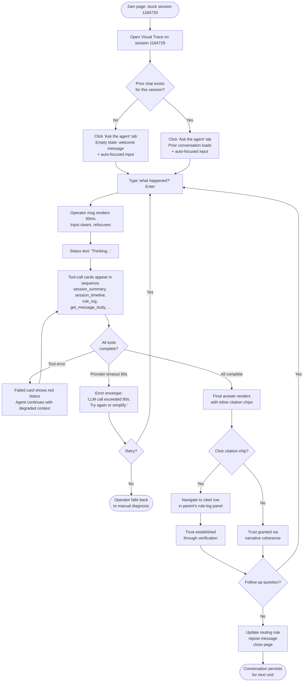
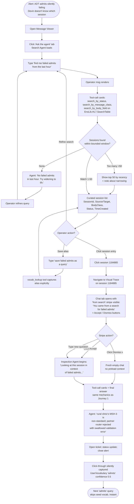
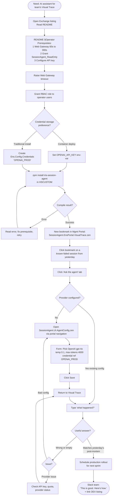

# UX Design Specification: iris-session-agent

**Author:** Joshua Brandt
**Date:** 2026-05-02

## Executive Summary

### Project Vision

`iris-session-agent` appears to operators as a **chat panel embedded inside two existing IRIS Mgmt Portal Zen pages** — Visual Trace (for inspecting a known session) and Message Viewer (for finding sessions). Operators don't navigate to a new URL or learn a new application; the agent appears *in the same page they're already in*, scoped to whatever the page is already showing. The chat is the primary interaction surface; multi-surface tool dispatch happens invisibly behind the scenes. The operator's first delight moment is *typing a question into a tab they didn't have to learn and getting a coherent multi-surface answer.*

The two pages get distinct chat experiences: Visual Trace's chat is **session-scoped** (one conversation per Ensemble session, history preserved against the session lifetime), Message Viewer's chat is **search-scoped** (TTL'd 30-day conversation focused on finding work, with click-through hand-off to the Inspection Agent). A third UI surface — `SessionAgent.UI.AgentConfig` — is the Zen-page configuration form where Operator-Admins choose provider/model/temperature/credentials per agent.

### Target Users

**Senior on-call integration engineers** (Marisol-class). 5+ years IRIS / Ensemble experience. Comfortable with SQL, ObjectScript, HL7 / FHIR / X12 message shapes, and every existing Mgmt Portal idiom. Carries the on-call pager. Engages the agent at 2am while time-pressured and sleep-deprived. Hates marketing-friendly micro-copy and generous whitespace. Wants efficient, dense, technical UI that gets out of the way.

**Junior integration engineers** (Devin-class). 6 months in. Competent debugger, doesn't yet have the schema in their head. Engages the agent when they can't reach senior backup. Disproportionately benefits — the agent is their *capability* multiplier, not just their *speed* multiplier. Needs the UX to be *self-revealing* (no senior sitting next to them to explain affordances).

**IRIS Platform Leads / Operator-Admins** (Aishah-class). Manages HSCUSTOM environments. Decides what software lands in production. Knows IPM, RBAC, Web Gateway intimately. Engages the configuration UI exactly twice per agent: install-day setup and rare config changes. Wants the config UX to **feel like other Mgmt Portal config pages** — not like a SaaS settings panel.

**Common context across all three:**

- **Desktop browsers only.** Chrome or Firefox, 1920×1080 or larger; occasional 1366×768 laptop on an on-call shift. Mobile is essentially never. Tablet is essentially never.
- **English-only** in v1 (per NFR — no i18n).
- **Already in the right page** when they engage — they don't navigate to "the agent app"; the agent is *there* when they open Visual Trace or Message Viewer.
- **Time-pressured.** Default to dense, factual, low-chrome UX. No tutorial overlays, no welcome-tour modals, no first-run animations.

### Key Design Challenges

1. **Real-estate constraint.** Visual Trace and Message Viewer have *fixed* existing layouts — left nav, breadcrumb, tab strip, body content. The chat must fit inside that without breaking the operator's existing workflow. PRD says "chat tab" — confirming where in the existing tab strip and how the panel sizes is design work.
2. **Visual density mismatch.** Mgmt Portal is information-dense by convention. Chat UIs default to conversational whitespace. Risk: chat feels out-of-place against parent's tighter layout. Mitigation needs explicit design decisions about line-height, padding, font sizing inside the chat panel.
3. **Long-form rendered output.** Agent answers will sometimes be multi-paragraph with tables, code blocks, citations to tool results. Need Markdown rendering that handles this gracefully in constrained vertical space without becoming a wall-of-text.
4. **Tool-call transparency vs. clutter.** Operator must be able to *see* which tools were dispatched (FR11 — grounded citations) without the chat feeling cluttered with technical noise. Default-collapsed tool-call cards with expand-on-demand is the obvious answer; confirm and detail.
5. **Long-running LLM call UX.** A 30-90 second LLM call is *long* by web-UX standards. Operator needs feedback that the agent is working without spinner-of-death anxiety. What's being "thought about" — current tool call? token streaming when supported? "checking event log" / "reading rule log" status text?
6. **Concurrent-tab serialization UX.** When two browser tabs hit the `%OpenId(id, 4)` lock (FR46), the second tab must show a graceful "another turn in progress" state — not a 500 error page or a stuck spinner.
7. **Empty / first-time vs. returning-conversation states.** Visual Trace's session-scoped history persists; an operator returning to a session sees prior conversation. Search Agent has TTL'd history. Both empty states (never asked) and returning states (ongoing thread) need design.
8. **Search-to-Inspection hand-off affordance.** Journey 2's "from search" stripe needs to be visible without being intrusive. Where does it sit? How does it dismiss? When the operator asks the next question, does the search-context-pass message stay in the transcript or hide after engagement?
9. **Provider-config Zen page coherence.** `SessionAgent.UI.AgentConfig` must feel like `EnsPortal.Credentials.zen` and other config pages, not a SaaS settings panel. Form layout conventions, label/control alignment, save semantics need to match the parent portal's idioms.
10. **Read-only signaling.** The operator should *understand* the agent cannot mutate state, without us cluttering the UI with "READ ONLY" stamps. Subtle affordance — perhaps in the agent intro / system message — that establishes trust without theater.

### Design Opportunities

1. **Citation chips that link to existing portal panels.** When the agent says *"the rule for `OrderType=LAB` returned the fallback target,"* the citation can link directly to the rule-log row in the page's existing rule-log panel. The operator's verification flow stays *inside the page they're already on* — no second tab, no navigation away. Higher-fidelity grounding than text-only citations.
2. **"From search" hand-off as a contextual stripe**, not a modal or banner. Invisible-when-respected UX pattern that fits the technical-operator's preference for low-chrome interfaces.
3. **Tool-call cards as expandable status updates during long calls.** Instead of a generic "thinking…" spinner, show a sequence of tool-call cards as they happen — *"checking message headers… reading event log… opening message body…"* Each card collapses to a one-line summary on completion. Turns the 30-90s wait into a visible-progress experience.
4. **Hot config change as a config-page action** — Operator-Admin saves a config change and the next agent turn picks it up automatically (per NFR-O2). UX should make this *obvious* without forcing reload — perhaps a small "config updated" toast in the chat panel that confirms the next turn will use the new settings.
5. **Audit log access via the existing Mgmt Portal SQL Query tool.** No new audit UI to build (per FR35); the operator's existing SQL workflow against `SessionAgent.Audit.LlmCall` and `SessionAgent.Audit.ToolCall` is the audit UX. Deliverable: a small **README §Audit** section with sample SQL queries for common questions ("how many tokens did we spend yesterday?", "what tools did the agent call?", "any timeouts?").
6. **Vocabulary capture as silent UX** — when an operator clicks through a search result (Journey 2 hand-off), the vocabulary entry is captured *invisibly*. No "save this query?" modal, no confirmation friction. Just learns. Surface emerges only if/when the operator explicitly asks "what aliases have I saved?" via a vocab utility tool.

## Core User Experience

### Defining Experience

**The single most important interaction:** typing a natural-language question into the chat input and receiving a grounded, multi-surface answer. This is the heartbeat of both agents and the entire product:

- **Inspection Agent**: question → narrative explanation grounded in citations
- **Search Agent**: query → curated session list with click-through to Inspection

Everything else in the product — credential management, RBAC enforcement, audit logging, vocabulary learning, multi-tab safety — exists to support that one interaction. If we get this interaction effortless, the rest follows. If it's awkward, the product fails regardless of how good the underlying tools are.

**Three high-importance secondary interactions:**

1. **Reading the answer with grounding** — citation chips that link directly to underlying tool results (and ideally to the existing Visual Trace panels showing the cited rows).
2. **Click-through from Search to Inspection** — Journey 2's hand-off; single click takes the operator to Visual Trace on the chosen session, with chat context preserved as a "from search" stripe.
3. **Returning to a prior conversation** — opening Visual Trace on a previously-discussed session shows the prior chat *already there*; no "load history?" button.

### Platform Strategy

- **Web only** (browser-rendered Zen pages inside the IRIS Management Portal). No native desktop app, no mobile app.
- **Desktop only.** Target 1920×1080; minimum 1366×768. Mobile and tablet are explicitly out of scope (PRD NFR-C6).
- **Mouse + keyboard.** No touch optimization. No swipe gestures, no long-press menus, no bottom-aligned action bars.
- **Online-only.** Agent requires both LLM API connectivity and IRIS access; no offline mode possible.
- **Embedded in existing Zen pages** — inherits IRIS Management Portal's platform constraints (Zen rendering, classic IRIS CSP / Mgmt Portal browser support, server-rendered + light-JS for chat panel).
- **Browsers**: evergreen Chrome, Firefox, Safari, Edge (latest two versions).
- **No device-specific capabilities to leverage** — no camera, no geolocation, no notifications API, no file system access. Pure text-in / text-out.

### Effortless Interactions

These should require zero conscious thought from the operator:

1. **Opening the chat panel.** One click on the "Ask the agent" tab. No loading screen, no welcome modal, no first-run tour. Chat is immediately ready, focused on the input field.
2. **Asking a question.** Type → Enter → wait. No model-selection prompt, no "are you sure you want to ask?" confirmation, no "would you like to also check…" suggestion menu.
3. **Verifying a claim.** Citation chip is one click; navigates the operator to the cited row in the existing Visual Trace panel without leaving the page or opening a new tab.
4. **Navigating from search hit to session inspection.** Single click on a search result; the chat-tab on the destination Visual Trace already knows the search context (no re-typing what they were looking for).
5. **Vocabulary capture.** Happens silently when the operator clicks through a search result. No "save this query?" modal, no confirmation friction.
6. **Returning to a prior conversation.** Operator opens Visual Trace on a previously-discussed session and the prior chat is *already there*. No "load history?" button.
7. **Switching providers / models.** Operator-Admin saves config in the Zen page; the next turn automatically picks up the new settings. No service restart, no chat reset, no warning modal.

### Critical Success Moments

These determine whether the product succeeds or fails:

**Make-or-break moments:**

| Moment | What success looks like |
|---|---|
| **First grounded answer** | Operator types *"what happened?"* on a real failed session and gets a coherent multi-surface answer they can verify by clicking citations. This is the *"this is better"* moment that defines the product. |
| **First successful search** | Operator types *"find me failed admits"* (Devin-level fluency) and gets a curated list where clicking one yields the broken session. Validates Search Agent's vocabulary + bounded-WHERE + indexed-prefilter actually works in practice. |
| **First hand-off click-through** | Operator goes from Search → Inspection in one click, and the destination chat *already knows* the search context. Validates the Journey 2 promise. |
| **First "vocabulary just works" moment** | Third time the operator types *"admits"* and the agent skips the seed-vocabulary detour, returning instant results. Validates the per-user learning loop. |
| **Install-day "it works"** | Operator-Admin runs `zpm install`, configures OpenAI credentials, opens a known-failed session, types *"what happened?"*, and gets a useful answer in under 18 minutes total elapsed (Aishah's Journey 3 benchmark). Validates the whole product end-to-end. |

**Failure scenarios that would permanently ruin trust:**

- Agent timeout with no useful error message → operator concludes the product is unreliable.
- Agent answer that fabricates details (citations don't match the claims) → operator never trusts the agent again, even on correct future answers.
- Citation chip that 404s or breaks the existing Visual Trace panel → broken integration; operator concludes the product is unstable inside their portal.
- Two-tab race condition that corrupts chat history → fundamental safety failure; operator escalates to maintainer or stops using.
- Provider swap that requires IRIS service restart → operator can't experiment with models, defaults to whatever was configured on install-day.

### Experience Principles

Five guiding principles for all UX decisions in this spec:

1. **Embedded, not adjacent.** The agent lives inside the page the operator already opened — same URL, same workflow, same navigation context. No new applications, no second browser tabs, no context switches. The agent is *there*, scoped to *what the operator is already doing*.

2. **Grounded and unfakeable.** Trust comes from two places: every claim in an answer links to an underlying tool result (the agent can't fabricate without it being visible), and the architecture forbids mutations (the agent can't break production data even if instructed). Both are *structural*, not theatrical — operators don't need warning labels because the system itself can't violate the constraint.

3. **Density over chrome.** Match the Mgmt Portal's information-dense conventions. No marketing whitespace, no decorative animations, no progressive disclosure for its own sake. Technical operators reward efficiency; default to dense, factual, low-chrome UX. The font scale, line-height, and padding inside the chat panel should feel continuous with the parent page, not like an inserted SaaS widget.

4. **Visible progress, not hidden waiting.** During a 30–90s LLM call, show *what the agent is doing* — sequenced tool-call cards updating as each tool dispatches and completes (*"checking message headers… reading event log… opening message body…"*). Long waits feel acceptable when the operator sees meaningful progress; generic spinners feel like the agent froze.

5. **Silent capture, explicit override.** Behaviors that should *just happen* — vocabulary learning, hand-off context-pass, audit logging, chat-history persistence — happen silently with no confirmation friction. Operators can override or inspect (explicit save-as, vocab-lookup utility tool, audit SQL queries) but never *have* to. Default UX is invisible automation; explicit controls are escape hatches, not first-line interactions.

## Desired Emotional Response

### Primary Emotional Goals

Operators using `iris-session-agent` should feel — in order of priority:

1. **Calm focus.** The 2am operator is sleep-deprived and time-pressured. Anything that adds visual or cognitive noise (animations, marketing copy, decorative chrome) makes their job harder. The agent should feel as quiet and focused as the existing Mgmt Portal — a tool that *amplifies their concentration*, not one that demands attention.
2. **Efficient productivity.** *"This saved me 25 minutes."* The dominant emotion after a successful diagnosis is relief, with a second-order *"I'm glad this exists."* The operator closes the page and moves on; they don't dwell.
3. **Confidence in the answer.** Trust comes from verifiability. When the agent says *"the rule for `OrderType=LAB` returned the fallback target,"* the operator can click and see the rule-log row that backs the claim. Confidence is *earned per-interaction* through grounding, not granted up-front through marketing.
4. **Empowerment without anxiety.** The operator feels they have a powerful tool that respects their authority — read-only by structure, audited by default, fully under their control. The agent doesn't surprise them, doesn't change settings, doesn't push notifications, doesn't recommend they upgrade.
5. **Competence uplift (junior-specific).** Devin should feel *"I can do this."* The agent doesn't make him *dependent*; it makes him *capable*. Seed vocabulary, grounded explanations, and citation chips that link to existing portal panels teach him the schema as he uses the agent — without lecturing him.

### Emotional Journey Mapping

| Stage | Emotion |
|---|---|
| **First encounter** (operator opens Visual Trace, sees new "Ask the agent" tab for the first time) | *Mild curiosity, low risk* — the tab is unobtrusive; nothing demands engagement. The operator can ignore it indefinitely. |
| **First question, waiting for first answer** | *Quiet attention* — tool-call cards show the agent doing work (*checking message headers… reading event log…*) so the wait feels like progress, not a stall. |
| **First answer received** | *"Oh — that's actually useful"* — the *"this is better"* moment. Operator clicks a citation and sees it grounded; mild surprise that it works. |
| **Active diagnosis** | *Calm focus* — the operator is reasoning with the agent, asking follow-ups, verifying claims. Should feel like a quiet conversation with a competent colleague. |
| **Successful resolution** | *Relief.* The operator updates the rule, closes the page, sleeps. No celebration micro-copy, no "great job!" toast — the resolution itself is the reward. |
| **Failure mode** (timeout, agent says "I'm not sure") | *Trust preserved* — the agent admitted uncertainty cleanly; no fabrication. Operator falls back to manual diagnosis without resentment. |
| **Returning to a session** (operator re-opens Visual Trace later, sees prior chat) | *Comfortable continuity* — picking up where they left off feels natural; no "load history?" confirmation. |
| **Install / configuration** (Operator-Admin) | *Professional confidence* — README operator-prerequisite section is concrete, the install is one command, the config Zen page feels like other Mgmt Portal config pages. |

### Micro-Emotions

| Pair | Outcome we want | How |
|---|---|---|
| Confidence ↔ Confusion | **Confidence** | Grounded answers with verifiable citations. Visible tool-call progress. The agent never says something the operator can't check. |
| Trust ↔ Skepticism | **Trust, earned per-interaction** | Three-layer read-only invariant + citation grounding. The agent never claims to be doing something it can't actually do. |
| Calm ↔ Anxiety | **Calm** | No animations, no notifications, no "Are you sure?" modals. The chat panel matches the parent page's stillness. |
| Accomplishment ↔ Frustration | **Quiet accomplishment** | Short time-to-resolution; clean failure modes when the agent can't help. No "let us know how we did!" feedback prompts. |
| Satisfaction ↔ Delight | **Satisfaction** is the goal; delight is fine *once* (the first-time moment) but shouldn't be a sustained design goal. Repeated delight tools become tiresome. |
| Respect ↔ Condescension | **Respect** | No tutorials, no welcome tours, no "did you know you can…" tips. The agent assumes technical fluency. |
| Companion ↔ Isolation | **Honest companion** — at 2am the operator is doing a job alone; the agent is, practically speaking, a colleague reading data sources. Not anthropomorphized into a "friend" or "buddy." Just a competent tool that happens to think. |

**Emotions to actively avoid:**

- **Anxiety** that the agent might break production. Solved structurally by the read-only invariant — the operator should feel this through the *system's behavior*, not through reassurance copy.
- **Frustration** at wasted time. Solved by zero friction between intent and result, no marketing modals, no welcome tours, no "would you like to also check…" suggestion menus.
- **Distrust** from fabricated answers. Solved by grounding — the agent says *"I'm not sure"* when uncertain rather than inventing.
- **Condescension** from over-explanation. Solved by treating the operator as a peer; technical vocabulary used directly without translation.
- **Sustained delight pressure.** Repeated delight feels manipulative for technical tools. The first answer is delightful; the hundredth answer should be *useful*, not delightful.

### Design Implications

| Emotional goal | UX choice |
|---|---|
| **Calm focus** | No animations beyond what Zen renders by default. No bright accent colors. No notification toasts other than the "config updated" confirmation in the chat panel. No badges, pulses, or attention-grabbing affordances. |
| **Efficient productivity** | Single-shot interaction: Enter to send, Esc to cancel. No multi-step wizards, no confirmation modals, no "draft saved" indicators. Auto-focus on the input field when the chat tab opens. |
| **Confidence in answer** | Citation chips inline with the agent's text. One-click navigation to the cited row in the existing Visual Trace panel. Expandable tool-call cards showing the raw tool output for the most-skeptical operator. |
| **Trust in safety** | Read-only invariant stated *once* in the agent's intro / system message ("I can't change anything; I only read.") and never repeated. No "READ ONLY" badges, no shield icons, no warning banners. |
| **Respect for expertise** | Technical vocabulary used directly: `Ens.MessageHeader`, `MessageBodyClassName`, `%Status` codes, BPL `await` boundaries — not translated into "session metadata," "message type," etc. The agent talks like an IRIS engineer to IRIS engineers. |
| **Relief on completion** | Answer is short, definitive, actionable when possible. No follow-up prompt ("what else can I help with?"). Operator closes the tab when they're done; the chat doesn't ask them to stay. |
| **Competence uplift (junior)** | Seed vocabulary lowers the bar to expert-level queries. Citation chips teach the schema by linking to it. Grounded explanations *show* the data the agent reasoned over, so the junior absorbs the layout passively. |
| **Honest companion** | Tool-call cards as visible progress make the agent feel like a colleague doing work — *"checking message headers… reading event log… opening message body…"* — rather than a black-box oracle. The work is visible because the agent is *with* the operator, not *for* them. |

### Emotional Design Principles

1. **Calm by default.** No bright colors, no animations, no "you've got mail!" notifications. The chat panel is quiet, like the operator's existing portal pages. Match the parent's stillness.
2. **Respect over charm.** Address the operator as a peer, not as a customer to delight. Avoid micro-copy that would feel patronizing to a senior engineer. *"Ask anything about this session"* (matter-of-fact placeholder), not *"Hi! What can I help you discover today?"*
3. **Trust through structure, not theater.** No shield icons, no "100% safe!" badges, no "AI-Powered" branding. Trust is established by the first grounded answer with verifiable citations and the absence of any mutation capability.
4. **Visible competence.** Show the agent doing work via tool-call cards. Operators trust agents that *show their work*; opaque agents feel like guesswork.
5. **Honor expertise, scaffold learning passively.** For Marisol, get out of the way. For Devin, the same UI naturally scaffolds — seed vocabulary, citation chips, grounded explanations — without explicit "tutorial mode" or "for-beginners" affordances.
6. **Once is enough.** Read-only is stated once in the intro, not in every message. The hand-off "from search" stripe shows once, dismisses on next user message, doesn't reappear. Repeated reassurance becomes noise.

## UX Pattern Analysis & Inspiration

### Inspiring Products Analysis

This product's design problem — a chat-grounded LLM agent embedded into an existing technical UI, dispatching tools against a structured backend, with citations linking to in-page data — has been solved well by several developer-tool predecessors. Five worth analyzing:

#### 1. Claude Code / Cursor / GitHub Copilot Chat (LLM-agent-in-IDE pattern)

**What they do well:**

- Tool-call cards rendered inline as the agent works (reading file X, running command Y) — matches our "Visible progress" principle exactly.
- Markdown rendering with code-block-aware syntax highlighting; technical content presented at the right density.
- Conversation persistence scoped to the working context (file, project, conversation thread) — same challenge as our session-scoped chat history.
- Edit/run/dispatch commands available without leaving the chat panel.
- Failure modes: when the agent can't do something, it says so cleanly rather than fabricating.

**What's transferable:**

- Tool-call card rendering pattern (collapsible, with one-line summary on completion).
- Conversation-as-the-primary-surface, with the agent's tool work visible but secondary.
- Markdown rendering inside a constrained panel without pretending to be a full document viewer.

#### 2. Anthropic's Claude.ai chat interface (grounded-citations pattern)

**What it does well:**

- Inline citation chips (when the agent quotes sources) that link directly to the source.
- Tool-use blocks rendered as expandable cards; default-collapsed showing tool name + brief, expand to see full input/output.
- Calm, dense text rendering; minimal chrome around messages; no avatar bubbles or timestamp clutter.

**What's transferable:**

- Citation chip pattern is exactly what we want for FR11 (grounded answers linking to tool results).
- Tool-use card collapse/expand pattern.
- "Conversation, not chat-app" tone — message blocks rather than chat-bubble-with-avatar styling.

#### 3. VS Code's panels (Terminal, Problems, Output) — embedded-panel pattern

**What they do well:**

- Embedded into the larger IDE without breaking the editor's layout.
- Tab strip at the top of the panel; panels switch contextually based on what the user is doing.
- Resizable but defaults to a sensible size; doesn't dominate the screen.
- Dense, technical, no decorative chrome.

**What's transferable:**

- The *pattern* of "agent panel as a peer alongside existing panels" is closest to our embedding model.
- Tab-strip placement and behavior — relevant for the "Ask the agent" tab in Visual Trace and Message Viewer.
- Panel sizing defaults that feel natural without crowding the parent.

#### 4. Linear's command palette and grounded answers — terse-technical-tone reference

**What it does well:**

- Fast, single-shot interactions (Cmd-K → type → result).
- Matter-of-fact micro-copy throughout; no marketing voice.
- Subtle, calm visual register that respects engineers' aesthetic sensibilities.

**What's transferable:**

- Tone register: terse, factual, low-chrome. Placeholder text patterns ("Find a session…", not "What can I help you find today?").
- Empty-state patterns: a single line of helpful context, no tutorial overlay.

#### 5. The IRIS Management Portal itself — visual coherence reference

**What it does:**

- Information-dense pages with multiple panels, tab strips, breadcrumbs.
- Standard Zen-rendered forms for configuration with consistent label/control layouts.
- Calm, neutral color palette; sans-serif typography; modest padding.
- Tabbed interfaces where each tab is a distinct context for the same underlying entity.

**What's transferable (and required):**

- *Everything visual* — colors, typography, spacing, button styles, form controls — must inherit from the parent. We're not designing a new system; we're matching one that already exists.
- Tab-strip integration pattern is the literal blueprint for where our chat tabs live.
- `EnsPortal.Credentials` and similar config pages are the model for `SessionAgent.UI.AgentConfig`.

### Transferable UX Patterns

Synthesizing across the five inspirations:

#### Layout & placement

- **Panel-as-tab-in-existing-strip** (VS Code panels, IRIS Mgmt Portal). Adopt: place the "Ask the agent" tab in the existing Visual Trace / Message Viewer tab strip.
- **Two-pane interior layout**: conversation transcript above, input field below (Claude.ai, Cursor, ChatGPT). Adopt with vertical-density tuning to match Mgmt Portal's tighter conventions.
- **Collapsible/expandable tool-call cards inline in the transcript** (Cursor, Claude Code). Adopt as our default rendering pattern for tool dispatch.

#### Interaction patterns

- **Single-shot send**: Enter to dispatch, Esc to cancel-while-waiting (Claude.ai, Cursor). Adopt.
- **Auto-focus on the input field when the panel opens** (most chat tools). Adopt.
- **Citation chips inline with text, click to navigate to source** (Anthropic, GitHub PR review threads). Adopt — adapted to navigate to in-page Visual Trace panels, not separate pages.
- **No confirmation modals for read-only actions** (Linear, dev tools generally). Adopt.

#### Visual & tonal patterns

- **Terse, factual placeholder copy** (Linear, Anthropic). Adopt: *"Ask anything about this session"* (not *"How can I help you today?"*).
- **No avatar bubbles, no per-message timestamps unless explicitly relevant** (Anthropic, Cursor). Adopt: messages are blocks of attributed text, not chat-app bubbles.
- **Inherit parent app's visual register entirely** (always — anything else feels like an inserted widget). Adopt.

### Anti-Patterns to Avoid

Patterns that look fine in consumer-marketing chatbots but actively break the experience for our users:

- **Drift / Intercom-style floating chat widget** in a corner of the page with a "Hi! Need help?" pop-up. Wrong tone entirely; would actively disrespect the on-call operator. **Avoid.**
- **ChatGPT-style emoji micro-copy and over-friendly tone** ("Great question!", "I'd be happy to help!", "Let me dive in!"). Patronizing to senior engineers; clutter for everyone. **Avoid.**
- **"AI is typing…" pulsing indicator** while the agent waits on tool dispatch. Theatrical; replaces visible-progress (which is what we want) with fake-liveness. **Avoid.**
- **Suggested-question chips after every answer** ("Want me to also check…?"). Feels like marketing engagement-bait; clutters the conversation. **Avoid.**
- **Welcome tour / tutorial overlay on first encounter.** Wastes the first impression on a senior who already knows what they're looking at. **Avoid.**
- **Persistent floating sidebar that defaults to expanded.** Steals real estate from the parent page. **Avoid** in favor of tab-strip integration.
- **Star ratings / thumbs-up-down on answers / "Was this helpful?" prompts.** Feedback noise; distorts trust dynamics; we measure success in pilot conversations, not in-product surveys. **Avoid.**
- **Dark / light theme switcher inside the chat panel.** The parent Mgmt Portal handles theming (or doesn't); we inherit. **Avoid.**
- **"AI-Powered" badges, "Beta" badges, shield/safety icons.** Theater. The product is what it is; trust comes from the architecture and the answers. **Avoid.**
- **Conversation threading / multiple parallel conversations in one panel.** One conversation per scope (session for Inspection, search session for Search). **Avoid** complexity.
- **Voice input / dictation.** Wrong context; technical operators type. **Avoid.**
- **Stop-and-wait modal during a tool call** ("Allow agent to call `get_message_body`?"). Tool-call permission models are appropriate for some agents (Cursor's edit mode); ours is read-only by structure, so explicit per-call permission is friction without value. **Avoid.**

### Design Inspiration Strategy

| What | Adopt / Adapt / Avoid | Why |
|---|---|---|
| **Tool-call cards inline in transcript** (Cursor, Claude Code) | **Adopt** | Direct fit for our "Visible progress" principle. |
| **Citation chips with click-to-source** (Anthropic, GitHub PRs) | **Adapt** — link to in-page Visual Trace panels rather than external sources | Direct fit for FR11 grounded answers + "Embedded, not adjacent" principle. |
| **Tab-strip placement** (VS Code panels, IRIS Mgmt Portal) | **Adopt** | Required for embedding; matches parent app's pattern. |
| **Terse, factual micro-copy** (Linear, Anthropic) | **Adopt** | Required by "Respect over charm" principle. |
| **No avatars, no message timestamps unless relevant** (Anthropic) | **Adopt** | Required by "Density over chrome" principle. |
| **Inherit parent visual register completely** (IRIS Mgmt Portal) | **Adopt** | Required by NFR-A1 and "Embedded, not adjacent" principle. |
| **Single-shot Enter-to-send** (everywhere) | **Adopt** | Required by "Effortless interactions". |
| **Collapsible/expandable tool-result cards** (Anthropic, Cursor) | **Adopt** | Solves "tool transparency vs. clutter" tension. |
| **Floating widget aesthetics** (Drift, Intercom) | **Avoid** | Wrong tone for technical operators; breaks embedding. |
| **Marketing-friendly micro-copy** (consumer chatbots) | **Avoid** | Patronizing to seniors; clutter for everyone. |
| **Welcome tours, suggested-question chips, feedback prompts** | **Avoid** | Engagement-bait patterns that conflict with "Respect over charm". |
| **Per-tool permission modals** (Cursor edit mode) | **Avoid** | Read-only by structure; permission gates would be friction without value. |
| **Star ratings, thumbs-up-down on answers** | **Avoid** | Distorts trust dynamics; feedback comes through pilot conversations. |
| **Voice input, dictation, multi-modal interfaces** | **Avoid** | Wrong context; v1 is text-in/text-out only. |

## Design System Foundation

### Design System Choice

**Inherited: IRIS Management Portal Zen-rendered styling, augmented with a small set of chat-specific tokens.**

This is *not* one of the three standard paths (Custom / Material / Themeable). It's a fourth path appropriate to embedded extensions of an existing application: **inherit the host application's design system entirely**, and add only the tokens that name affordances the host doesn't already provide.

| Layer | Source | What it provides |
|---|---|---|
| **Foundational tokens** (color, typography, spacing, form controls, focus states) | IRIS Management Portal Zen + `EnsPortal.Application` CSS | Inherited as-is. Inherits parent palette, font, sizing scale, button styles, input styles, tab strip styles. |
| **Markdown rendering inside chat** (code blocks, inline code, tables, blockquotes, lists) | Vendored `marked` + `Prism.js` bundled themes + `DOMPurify` (Growth-tier; MVP uses simpler render path) | Provides syntax-highlighted code blocks, semantic Markdown structure inside the chat panel. Prism theme selected to match parent palette. |
| **Chat-specific affordances** (tool-call cards, citation chips, message attribution, "from search" stripe, status text, empty/error/loading states) | New tokens added by `iris-session-agent` | The minimum new design surface — only what doesn't already exist in the parent. |

### Rationale for Selection

Five reasons the inherit-and-augment approach is correct here, and the standard alternatives are wrong:

1. **NFR-A1 commits to inheriting Mgmt Portal accessibility and styling.** Choosing any external design system (Material, Ant, Tailwind) would *contradict* a binding NFR. The PRD already locked this.
2. **The product is embedded inside Zen pages.** Zen renders server-side; layering Material or MUI on top is technically possible but produces visual incoherence — operators would feel they'd jumped into a different app mid-page.
3. **Operator users are deeply familiar with Mgmt Portal idioms.** Buttons, form controls, tab strips that don't look like the rest of the portal create unnecessary friction. The "Embedded, not adjacent" experience principle requires visual continuity.
4. **Maintenance cost favors minimal addition.** A single-author hobby project cannot maintain a parallel design system. The smaller the new design surface, the less work to keep current as Mgmt Portal evolves.
5. **The new affordances we genuinely need are small** — chat is fundamentally text-in / text-out; the only novel UI elements are tool-call cards, citation chips, and a few status indicators. A full design system would be massive overkill.

### Implementation Approach

**Foundational layer — pure inheritance:**

- All Zen pages (`SessionAgent.EnsPortal.VisualTrace`, `SessionAgent.EnsPortal.MessageViewer`, `SessionAgent.UI.AgentConfig`) extend their parent classes and inherit `EnsPortal.Application`'s style sheet.
- Chat panel uses `<div class="ribbonTitle">`, `<table class="DetailTable">`, standard Mgmt Portal Zen CSS classes wherever possible — no custom CSS class invented when an existing one would work.
- Form controls in `SessionAgent.UI.AgentConfig` use Zen native components (`<text>`, `<combobox>`, `<select>`, `<button>`) styled by the parent stylesheet.
- Color palette, font family, font sizes, line heights: inherited entirely. No hex codes, no font-family declarations, no font-size overrides in `SessionAgent.*` stylesheets except where strictly necessary for chat-specific affordances.

**Augmentation layer — small, documented, scoped:**

A single new stylesheet ships at `/csp/static/iris-session-agent/sessionagent-chat.css` (Growth-tier; MVP can use inline style for simpler render). It defines tokens *only* for chat-specific affordances:

| Token category | Purpose | Notes |
|---|---|---|
| `--sa-message-operator-bg` / `--sa-message-agent-bg` | Subtle background distinction between operator and agent message blocks | Use parent palette's existing low-contrast background variants. No bright accent colors. |
| `--sa-tool-card-border` / `--sa-tool-card-bg` | Tool-call card container styling — distinct from message blocks but harmonious | Lighter weight than message blocks; subtle border or rule. |
| `--sa-citation-chip-bg` / `--sa-citation-chip-text` | Inline citation chip styling — pill-shaped or bracketed-link affordance | Subtle; not bright; matches parent's link color where reasonable. |
| `--sa-status-text-color` | "Checking message headers..." mid-flight progress text | Slightly de-emphasized text color from parent palette. |
| `--sa-from-search-stripe-bg` / `--sa-from-search-stripe-border-left` | Single-line "from search" context stripe | One-line, dismissable, subtle accent on left edge. |
| `--sa-error-text-color` | Error envelope rendering inside chat | Use parent palette's existing error/warning color, not a custom red. |

**Markdown rendering layer (Growth-tier):**

Vendored bundle hosted at `/csp/static/iris-session-agent/`:

- `marked` ≥ 18.0.2 — Markdown → HTML rendering
- `Prism.js` curated languages: ObjectScript (custom grammar if available, otherwise generic), JavaScript, JSON, SQL, HL7, XML
- `Prism.js` theme: select a low-contrast theme that matches Mgmt Portal's palette (likely Prism's "Prism" or a custom-derived stylesheet)
- `DOMPurify` for HTML sanitization before insertion

**MVP fallback:** If the vendored bundle slips to Growth tier, MVP renders Markdown via a simpler server-side `marked`-equivalent in ObjectScript (or plain text with line-break handling). Trade-off: code-block syntax highlighting is post-MVP.

### Customization Strategy

**Don't customize the parent.** The product has no business overriding Mgmt Portal styles — that would break visual coherence and create maintenance liability when InterSystems updates the portal.

**Do scope the additions tightly.** New tokens defined in `sessionagent-chat.css` apply only to elements with `class="sa-*"` (e.g., `sa-message-block`, `sa-tool-card`, `sa-citation-chip`). Selectors are namespaced; we don't reach outside our DOM subtree.

**Theming responsiveness:** if the parent Mgmt Portal supports multiple themes (light/dark/high-contrast), our chat-specific tokens use CSS custom properties that *resolve* against parent-defined custom properties where possible. This way the chat panel's look automatically follows whatever theme the operator's portal is configured to.

**Future-proofing:** if InterSystems modernizes the Mgmt Portal styling (e.g., adopts CSS Grid layouts, dark-mode tokens, redesigned form controls), our additions inherit cleanly because they reference parent tokens rather than hardcoding values. Re-skinning the chat is a question of updating the small `sessionagent-chat.css` to reference new parent tokens — not a redesign.

### Token Naming Convention

All new design tokens use the prefix `--sa-` (SessionAgent) for namespacing:

- `--sa-message-operator-bg`
- `--sa-tool-card-border`
- `--sa-citation-chip-bg`
- `--sa-status-text-color`

Class names use the `sa-` prefix similarly:

- `sa-message-block`
- `sa-tool-call-card`
- `sa-citation-chip`
- `sa-from-search-stripe`

This keeps our additions cleanly identifiable and prevents collision with anything Mgmt Portal might add in future versions.

## Defining Core Experience

### Defining Experience

**One-line description:** *Type a question, watch the agent read the surfaces, click a citation to verify.*

If we nail this single interaction loop end-to-end, every other UX consideration in the spec follows naturally. Everything else in the product — credentials, RBAC, audit, vocabulary learning, multi-tab safety — exists to *enable* this interaction without disrupting it.

The defining experience differs slightly between the two agents:

- **Inspection Agent (Visual Trace embed):** *"Ask what happened. Get a grounded narrative explanation. Click citations to verify."*
- **Search Agent (Message Viewer embed):** *"Ask what you're looking for. Get a curated list. Click through to inspect."*

Both share the same fundamental loop: type → wait with visible progress → read → verify → ask again or move on.

### User Mental Model

How operators *think about* the chat interaction matters because their existing mental analogs shape expectations on first use.

**Three mental analogs operators carry into this product:**

1. **"Advanced search that explains itself"** — closest to how Search Agent users will mentally model the interaction. They're used to typing terms into Message Viewer's filter and getting result lists. The Search Agent extends that mental model: type natural language → get curated list. Familiar.
2. **"Colleague who reads everything for you"** — closest to how Inspection Agent users will mentally model the interaction. They're used to running diagnoses by reading multiple panels in sequence; the Inspection Agent feels like a colleague who reads them in parallel and summarizes. New, but easy to grasp.
3. **"AI tool that might fabricate"** — the *anxious* mental model some operators bring from prior LLM experience (especially with consumer ChatGPT). Risk: skepticism about whether the agent is "making things up." Mitigation: citation grounding makes verification trivial, which collapses the anxiety into trust on first interaction.

**Where users are likely to get confused or frustrated:**

| Confusion | Mitigation |
|---|---|
| *"What can the agent actually do? What tools does it have?"* | The agent's intro / first-message in an empty conversation lists ~3-5 example questions ("Try asking: 'what happened?', 'why did the rule fire?', 'show me the body'") — terse, declarative, not a tutorial. |
| *"How specific should I be? Should I name the session ID, or does it know?"* | Inspection Agent already knows the session (scoped from page context); placeholder copy hints at this ("Ask anything about *this session*"). Search Agent's placeholder is broader ("Find sessions where..."). |
| *"How do I know if I should trust the answer?"* | Citation chips inline with every claim; operator clicks to verify. Trust is built per-interaction through verification, not granted up-front. |
| *"How do I clear / reset / start over?"* | Inspection Agent: there is no "clear conversation" — it's session-scoped and persists with the session. Search Agent: a small "new search" affordance creates a new searchSessionKey. Both decisions documented in the design; the absence of "clear" is intentional, not an omission. |
| *"Did my message get through? Is the agent doing anything?"* | Operator's message renders immediately on send; tool-call cards appear within ~1 second as the agent dispatches. Visible-progress is the answer to "is something happening?" |

### Success Criteria

(Cross-reference: §Core User Experience → Critical Success Moments enumerates the make-or-break moments. This subsection adds the *interaction-level* success criteria — what makes the *mechanic* feel right.)

The core interaction succeeds when:

- **Send-to-first-feedback latency is ≤2 seconds.** The operator's message echoes immediately; the first tool-call card appears within ~1-2 seconds of send. Anything longer feels like a stall.
- **Tool-call cards advance visibly.** Each card transitions from "running" → "complete (collapsed summary)" within seconds; multiple cards appearing in sequence convey active work.
- **Final answer length matches operator urgency.** Short answers (1-2 paragraphs) for simple questions; longer answers only when complexity warrants. The agent doesn't pad.
- **Citation chips are clickable and resolve correctly.** Click → navigate to in-page Visual Trace panel showing the cited row. Failure here breaks the trust loop.
- **Follow-up questions feel continuous.** The agent has the prior conversation context; operator doesn't have to re-establish what session they're discussing.
- **Closing the page and returning preserves the conversation.** No "load history?" prompt; the prior chat is just there.

### Novel UX Patterns

**Verdict: this product combines established patterns; nothing requires net-new interaction invention.**

| Pattern | Status | Reference |
|---|---|---|
| Embedded panel in tab strip | Established | VS Code panels, IRIS Mgmt Portal |
| LLM chat conversation transcript | Established | Anthropic Claude, ChatGPT, Cursor |
| Tool-call cards in transcript | Established | Cursor, Claude Code |
| Inline citation chips with click-to-source | Established | Anthropic Claude, GitHub PR review |
| Persistent conversation history scoped to context | Established | Cursor (per-project), Claude Code (per-conversation) |
| Auto-focus input on panel open | Established | Most chat tools |
| Single-shot Enter-to-send | Established | Universal |
| Search → click-through hand-off with context-pass | Established | E-commerce search → product page (with breadcrumb) |
| "From-search" context indicator stripe | Mildly novel within IRIS context, but the pattern is just a contextual breadcrumb stripe | n/a |

**Operator-education needs: minimal.** Senior operators (Marisol-class) recognize these patterns from Claude / Cursor / VS Code. Junior operators (Devin-class) recognize them from ChatGPT and similar. We don't need a tutorial; we need consistent execution of patterns operators already understand.

**The product's IRIS-domain novelty** (pure-OS LLM agent, two-stage body search, Anthropic-canonical adapter inversion) lives in the architecture, *not* in the user-facing interaction. The operator's experience is satisfyingly familiar.

### Experience Mechanics

The step-by-step flow of the defining interaction, broken down by phase. Two flows: **Inspection** (in Visual Trace) and **Search** (in Message Viewer). The infrastructure is shared; the interaction differs in input register and output shape.

#### Inspection Agent — Defining Interaction

**1. Initiation**

- Operator opens Visual Trace on a session via existing Mgmt Portal navigation (unchanged from current behavior — operator doesn't learn new navigation).
- The existing tab strip on Visual Trace now includes an *additional* tab labeled **"Ask the agent"** (or similar, finalized in Step 11).
- Operator clicks the tab. Chat panel loads.
- **First-time state (no prior conversation for this session):**
  - Welcome message from agent — terse, ~3 lines: *"I can read this session's headers, bodies, event log, rule log, and BP state. I can't change anything; I only read. Try: what happened? · why did the rule fire? · show me the failing body."*
  - Input field below the welcome message, auto-focused, placeholder: *"Ask anything about this session."*
- **Returning state (prior conversation exists for this session):**
  - Prior conversation transcript renders, scrolled to the most recent message.
  - Input field below the transcript, auto-focused, placeholder: *"Continue the conversation."*

**2. Interaction**

- Operator types a natural-language question. Input field grows vertically as needed (single-line default, expands to ~3 lines max before scroll).
- Operator hits Enter. (Shift+Enter inserts a newline without sending — standard chat behavior.)
- Operator's message immediately renders as a message block in the transcript. Input field clears; auto-focuses for next message.
- Agent's status indicator appears: a single-line de-emphasized text — *"Thinking..."* — for the first ~1 second.
- As the agent dispatches tools, the status indicator transitions into a sequence of **tool-call cards**:
  - Each card has a status (running / complete / error), tool name, and a one-line summary on completion.
  - Cards appear in order of dispatch; running cards animate (subtle pulse on the running indicator, not the whole card).
  - Operator can click any card to expand and see the raw tool output (tool input args + JSON result).
- After the agent's final reasoning step, the **final answer message block** renders below the tool-call cards.
  - Answer is Markdown-rendered: paragraphs, code blocks, tables, bullet lists as appropriate.
  - Inline **citation chips** appear within the answer text — each chip is a small bracketed reference (e.g., `[rule_log:42]`) that the operator can click to jump to the cited row in the parent Visual Trace's existing rule-log panel.
- Operator can:
  - Type a follow-up question (input is already focused; conversation continues).
  - Click a citation chip to verify in the parent panel.
  - Click a tool-call card to inspect raw data.
  - Switch to another tab in the parent (Trace / Body / Events / etc.) — conversation persists.
  - Close the page — conversation persists for next visit.

**3. Feedback**

- **Send-acknowledged:** operator's message renders within ~50ms of Enter. Confirms input was received.
- **Work-in-progress:** tool-call cards appear in sequence; status indicators advance. Confirms the agent is doing work, not stalled.
- **Reasoning-done:** final answer renders below the tool cards. Confirms the agent has finished and reached a conclusion.
- **Verification-available:** citation chips are clickable; click navigates to in-page panel showing cited data. Confirms the answer is grounded.
- **Failure modes:**
  - **Provider timeout:** agent message renders an error envelope: *"The LLM call exceeded 90 seconds. The provider may be overloaded or the question too complex. Try again or simplify."* Audit row written.
  - **Provider error:** error envelope: *"Couldn't reach `<provider>`: `<reason>`. Check the provider's status or your API key."* Audit row written.
  - **Tool error:** the failing tool's card shows a red status with the error reason; the agent continues processing with the degraded context and notes the limitation in its answer (*"I couldn't open the body of message 12 — it returned `<UNDEFINED>`. Continuing with what I can see..."*).
  - **Concurrent-tab lock:** second tab shows a non-modal banner at the top of the chat panel: *"Another browser tab is mid-conversation. Switch to it or wait for it to complete."* Disables the input field until the lock releases.
  - **Insufficient context:** if the operator's question is ambiguous, the agent asks back: *"Do you mean the parent session 1184729 or the related session 1184731?"*

**4. Completion**

- There is **no explicit "done" state**. The conversation persists indefinitely (until `Ens.MessageHeader.Purge()` removes the underlying session and the daily sweep cleans the chat-history row).
- Operator may close the page, switch tabs in the parent Visual Trace, navigate elsewhere — chat history is preserved. Returning to the same session shows the conversation right where it was.
- **No "Was this helpful?" prompt, no thumbs-up/down, no "Continue conversation?" modal.** The operator simply moves on.
- **No conversation export, share, or archive UI in v1.** Operator-Admin can SQL-query `SessionAgent.Chat.History` for review purposes.

#### Search Agent — Defining Interaction (Differences from Inspection)

The infrastructure is shared; the *interaction* differs in input expectations and output shape.

**Initiation differences:**

- Operator opens Message Viewer (existing flow, unchanged).
- New tab in the existing tab strip: **"Ask the agent"** (same label as Inspection — operators learn the affordance once across both pages).
- First-time placeholder: *"Find sessions where..."* (broader prompt than Inspection's session-scoped *"Ask anything..."*).
- Returning state: prior search-session conversation (TTL'd 30 days) loads.

**Interaction differences:**

- Operator types a search query (e.g., *"failed admits in the last hour"*).
- Tool-call cards still appear during dispatch (`search_by_status`, `search_by_message_class`, etc.).
- **Final answer is structured as a curated list** — agent's narrative + a list of clickable session entries:
  - Each entry shows: SessionId · Source/Target · MessageBodyClassName · Status · TimeCreated · brief context.
  - Click on a session entry → navigates to Visual Trace on that session, opens the Inspection Agent's chat tab, displays a **"from search"** stripe at the top of the chat panel: *"You came from a search for failed admits — want me to look at this session?"* with a one-click acceptance and one-click dismissal.

**Feedback differences:**

- If no sessions match: agent says so plainly and suggests refinements (*"No failed admits in the last hour. Try widening to the last 6 hours, or check the connection — the source clinic may not have sent any."*).
- If too many sessions match (>50 over the bounded window): agent returns the top 50 with a note (*"Showing 50 most recent of 217 matches. Tighten the time window or specify a source/target to narrow further."*).

**Completion differences:**

- Operator typically completes by clicking through to a session (which transitions to the Inspection Agent flow).
- Or by saving an alias for future use (*"Save 'failed admits' as a query for me"* → `vocab_lookup` tool captures it explicitly; otherwise vocabulary learns silently from click-through).
- Search-session conversation persists for 30 days then sweeps.

## Visual Design Foundation

### Color System

**Inheritance status:** entirely inherited from IRIS Mgmt Portal's `EnsPortal.Application` stylesheet. No new color palette is defined.

(Cross-reference: §Design System Foundation → Implementation Approach for the inheritance pattern, and §Token Naming Convention for the small set of `--sa-*` semantic tokens added for chat-specific affordances.)

**The minimum new color decisions, with semantic mapping:**

| Token | Semantic role | Resolves to (target) |
|---|---|---|
| `--sa-message-operator-bg` | Background of operator's message blocks | Parent's existing low-contrast surface variant (e.g., `#f5f5f5` or equivalent) |
| `--sa-message-agent-bg` | Background of agent's message blocks | Parent's default content background (typically `#ffffff` or equivalent) |
| `--sa-tool-card-border` | Border of tool-call cards | Parent's standard rule color (e.g., the same color used for table borders) |
| `--sa-tool-card-status-running` | Color of "running" status indicator | Parent's de-emphasized text color (or a subtle accent) |
| `--sa-tool-card-status-complete` | Color of "complete" status indicator | Parent's neutral / muted text color |
| `--sa-tool-card-status-error` | Color of "error" status indicator | Parent's existing error/warning color (no custom red) |
| `--sa-citation-chip-bg` | Background of inline citation chips | Parent's existing link-background or callout-background |
| `--sa-citation-chip-text` | Text color of citation chips | Parent's existing link color |
| `--sa-from-search-stripe-bg` | Background of "from search" context stripe | Subtle accent — parent's lightest highlight tint |
| `--sa-from-search-stripe-border` | Left-edge accent on the "from search" stripe | Parent's existing accent or callout-border color |

**Final values for these tokens are deferred to architecture/implementation** — they require reading `EnsPortal.Application.cls` and the parent stylesheet to resolve to actual color values. The architecture document specifies the resolved hex values; this PRD-level UX spec specifies semantic mapping only.

**Accessibility:** color contrast ratios inherit from Mgmt Portal. Where we layer (e.g., citation chip text on chip background), contrast must meet WCAG AA at minimum — verified during architecture by checking the resolved parent palette colors.

### Typography System

**Inheritance status:** entirely inherited from IRIS Mgmt Portal.

- **Font family:** inherited (typically a sans-serif stack used by the parent — Verdana, Arial, or whatever is set in `EnsPortal.Application.cls`).
- **Font size:** inherited body size (typically 11-12px in IRIS Mgmt Portal — denser than modern web defaults; we honor that density).
- **Line height:** inherited body line-height (typically ~1.4-1.5).
- **Font weight:** inherited (typically 400 normal / 700 bold).

**Chat-panel specific typography decisions:**

- **Message block text:** matches body inherited typography exactly. No "chat-specific" font choices.
- **Code blocks within answers:** monospace font from Prism.js theme; sizing pegged to the parent's monospace conventions where they exist (or to a sensible default like 11px). Inline code: same monospace, same size as body, with a subtle background.
- **Tool-call card label:** body font, with the tool name in monospace (`session_summary`, `get_message_body`).
- **Status text:** body font, italic, slightly de-emphasized color (`--sa-status-text-color`).
- **Citation chips:** body font, slightly tightened letter-spacing for the bracketed reference style; otherwise inherited.

**No web-fonts loaded.** Prism.js's bundled monospace stack is sufficient; we don't load Google Fonts or any external font CDN (per NFR-C5 — no CDN dependency).

### Spacing & Layout Foundation

**Inheritance status:** parent Mgmt Portal sizing conventions for base spacing scale. Chat-panel-internal vertical rhythm is the new specification this step adds.

#### Base spacing scale

Parent uses a roughly 4px / 8px scale with no formal token system. The chat panel honors this:

- `4px` for tight inline spacing
- `8px` for related-element spacing
- `12px` for separation between sibling components
- `16px` for larger structural gaps
- `24px` reserved; rarely used inside the chat panel

#### Chat panel layout

```
┌──────────────────────────────────────────────────┐
│  Tab Strip (inherited from parent)               │
├──────────────────────────────────────────────────┤
│  [from-search stripe — when applicable]          │  <- 32px height, 12px horizontal pad
├──────────────────────────────────────────────────┤
│                                                  │
│  Message Transcript (scrollable)                 │
│  ┌─[ Operator message block ]──────────────┐    │
│  └────────────────────────────────────────┘     │
│  ┌─[ Tool-call card 1 (collapsed) ]───────┐    │
│  └────────────────────────────────────────┘     │
│  ┌─[ Tool-call card 2 (running) ]─────────┐    │
│  └────────────────────────────────────────┘     │
│  ┌─[ Agent message block ]────────────────┐    │
│  │  Answer text with [citation:42] chips  │     │
│  └────────────────────────────────────────┘     │
│                                                  │
├──────────────────────────────────────────────────┤
│  Input Field [Ask anything about this session]   │  <- 40-80px (auto-grows)
└──────────────────────────────────────────────────┘
```

#### Vertical rhythm specifics

| Element | Height / Spacing |
|---|---|
| Tab strip | inherited (~24-28px) |
| "From search" stripe | 32px height, 12px top/bottom padding, 12px left/right padding, dismissable |
| Message transcript area | flex-grow; min-height 240px; max-height bounded by parent panel; vertical scroll when content overflows |
| Operator message block | 8px vertical padding, 12px horizontal padding; bottom margin 12px before next message |
| Agent message block | 8px vertical padding, 12px horizontal padding; bottom margin 12px before next message |
| Tool-call card (collapsed) | 24px height, 8px vertical padding, 12px horizontal padding; 4px bottom margin between sibling cards |
| Tool-call card (expanded) | content-driven height, max 320px before internal scroll; same horizontal padding |
| Citation chip | inline; 2px vertical padding, 6px horizontal padding; 2px horizontal margin from surrounding text |
| Status indicator text | 24px height; left-aligned; italic |
| Input field area | 40px default, auto-grows to 80px max; 8px vertical padding, 12px horizontal padding; 8px top margin (separation from transcript above); fixed to bottom of panel |

#### Layout principles

1. **Density first.** Match the Mgmt Portal's tighter conventions; don't import modern-web's generous whitespace. The chat panel feels at home in a dense tabbed interface.
2. **Single-column transcript.** No multi-pane layouts inside the chat panel. Transcript on top, input on bottom — universal chat convention.
3. **Vertical scroll only for transcript content.** Tab strip, "from search" stripe, and input field are pinned; only the transcript area scrolls.
4. **Auto-scroll to most recent on new content.** When a new message or tool-call card appears, the transcript scrolls to keep it in view — *unless* the operator has scrolled up to read history (don't pull them away from what they're reading).
5. **No horizontal scroll within message content.** Code blocks scroll horizontally within their block when content exceeds width, but the message block itself respects the panel width.

### Accessibility Considerations

(Cross-reference: PRD NFR-A1 — accessibility commitment is **inheritance from Mgmt Portal Zen**; no additional WCAG conformance is independently claimed.)

The chat panel honors the parent portal's accessibility characteristics by:

- **Inheriting all keyboard navigation** that Zen pages provide (Tab to move between focusable elements, Enter to activate buttons, Esc to dismiss modals where they exist).
- **Native input elements only** — `<textarea>` for the input field, native HTML buttons for actions, native form elements in the config Zen page. Operators using screen readers get standard semantics for free.
- **Color is not the sole indicator of state** — tool-call card status uses both color AND a status text label (`Running...`, `Complete`, `Error: ...`); error envelopes use both color AND explicit text.
- **Focus indicators** inherited from parent — operators using keyboard navigation see focus rings on the chat input, tool-call cards, citation chips, and any clickable elements.
- **Citation chips are real anchors** (`<a>`) with descriptive text — *not* `<div>` with `onclick`. Screen readers announce them as links.
- **Tool-call cards are semantic disclosure widgets** — `<details>`/`<summary>` pattern (or equivalent) so the expand/collapse behavior is keyboard-accessible and screen-reader-comprehensible.

**No additional accessibility commitments beyond inheritance.** Operators using assistive technologies that already work with the IRIS Management Portal will find the chat panel accessible to the same degree; operators on portals where accessibility is degraded see the same degradation here.

## Design Direction Decision

### Design Directions Explored

Two viable directions within the inherit-and-augment constraint, plus one explicitly rejected for violating the locked design system commitment.

#### Direction A — "Quiet Inheritance" *(recommended)*

Chat panel looks **as much like an existing Mgmt Portal panel as possible**. Tool-call cards mirror the borders and padding of `<table class="DetailTable">` rows. Operator/agent message blocks differ only by an **attribution prefix** (a one-line label like `**You** —` or `**Agent** —`) plus a *minimal* background tint to aid scanning. Citation chips are inline bracketed-style links matching parent's link styling. No accent colors. Maximum continuity with parent.

**Visual weight: minimal.** A first-time operator scanning the page might not initially notice the chat panel is "different" from the parent's existing panels — the integration is invisible. That's the point.

**Tradeoff:** lower visual hierarchy in the transcript means scanning longer conversations is slightly harder. Mitigated by collapsible tool-call cards and short answer paragraphs.

#### Direction B — "Subtle Differentiation"

Chat panel is recognizably **the agent's space** within the page. Message blocks have stronger background distinction (operator slightly tinted, agent default). Tool-call cards have a 2px left-edge accent in the parent's link color (status-colored when running/error). Citation chips are pill-shaped with subtle background tint (still inheriting parent link color). Slightly more visual hierarchy but still inheriting palette.

**Visual weight: subtle but recognizable.** A first-time operator immediately understands "this panel is different from the others" — but every visual element still inherits the parent palette and typography.

**Tradeoff:** slightly more visual prominence than Mgmt Portal's existing convention. Risks feeling like an "inserted widget" if pilot operators are very palette-sensitive.

#### Direction C — "Modern chat overlay" *(REJECTED)*

Avatar circles, rounded message bubbles with distinct color accents, modern-web chat UI conventions (typing indicators, message reactions, threaded replies).

**Rejected because:**

- Violates NFR-A1 (no commitment to inherited Mgmt Portal accessibility).
- Violates Experience Principle 1 ("Embedded, not adjacent") and Principle 3 ("Density over chrome").
- Inverts the *fit, not moat* product positioning.

Documented here only to make the rejection explicit; not a viable option.

### Chosen Direction

**Direction A — "Quiet Inheritance."**

#### Specific design decisions adopted from Direction A

| Element | Decision |
|---|---|
| **Tab placement** | "Ask the agent" tab appended to the *right* of existing tabs in the parent's tab strip — operators reach existing tabs by muscle memory; ours sits adjacent without disrupting the established order. |
| **Operator vs. agent message attribution** | Attribution prefix: `**You** —` and `**Agent** —` at the start of each message block, in body weight. Minimal background tint difference (`--sa-message-operator-bg` vs. `--sa-message-agent-bg`) — operator's blocks slightly tinted from default, agent's blocks at default content background. |
| **Tool-call card visual** | Single-pixel border in `--sa-tool-card-border` (parent's standard rule color); 8px vertical / 12px horizontal padding; running-status icon inline-left; tool name in monospace; one-line summary text after completion. No left-edge accent. No background tint — pure border-defined. |
| **Citation chip style** | Bracketed inline link: `[rule_log:42]` rendered as a real `<a>` element with parent's link color and subtle background tint via `--sa-citation-chip-bg`. No pill shape, no hover-card popup. Click navigates to the cited row in the parent's existing panel. |
| **"From search" stripe** | Single line at the top of the chat panel (above the transcript), 32px tall, with a 3px left-edge accent in `--sa-from-search-stripe-border` and a subtle tint background. Dismissable via a small `×` on the right. Disappears on first follow-up message; doesn't reappear. |
| **Status text mid-flight** | Italicized de-emphasized text — *"Checking message headers..."* — replaced by tool-call cards as they appear. Not a separate bordered region. |
| **Empty state (first conversation)** | 3-line agent welcome message rendered as an agent message block (same styling as any other agent message), followed by auto-focused input field. No separate "empty state" component. |

### Design Rationale

Why Direction A over Direction B:

1. **Experience Principles 1, 3, and 6 all converge on quiet.** "Embedded, not adjacent" + "Density over chrome" + "Once is enough" all favor minimum visual weight. Direction A is the literal application of those principles.
2. **Operator users explicitly prefer low-chrome interfaces.** Step 4's emotional-response work locked "Calm focus" as the primary emotional goal and explicitly rejected sustained-delight UX. Direction B's stronger visual differentiation is a small step toward chrome that the operator users don't reward.
3. **Maintenance cost of Direction A is lower.** Fewer custom tokens, fewer edge cases when Mgmt Portal evolves, fewer decisions to revisit during architecture.
4. **Direction B is reachable from Direction A without redesign.** If pilot operators report difficulty distinguishing chat content from parent panels, we can layer additional differentiation (left-edge accents, stronger backgrounds) onto Direction A's foundation. The reverse — backing out of Direction B's differentiation — is harder once operators have learned the visual register.
5. **Direction A reduces risk of looking dated.** Heavy chat-UI styling (avatars, bubbles, accent gradients) has dated rapidly across LLM products in the last 3 years; the tabular/list aesthetic Mgmt Portal uses is timeless. We inherit that timelessness for free.

### Implementation Approach

**Sequencing:**

- **MVP (Epic 3 demo-able — see [`epics.md`](epics.md)):** ship Direction A's *minimum* — attribution prefix only, no background tint differentiation, no `--sa-*` tokens beyond what's strictly needed. Tool-call cards rendered as plain bordered divs. **Citation chips ship as real navigable links** that hook into the parent Visual Trace's existing `selectItem` / `updateTabs` API (research finding: feasible from day 1 because we're a subclass of `EnsPortal.VisualTrace`). The chat panel is visually plain but the trust loop is complete.
- **Growth (completing v1):** add the small `--sa-*` token set for subtle visual cohesion (background tints, citation-chip styling, status colors). Vendored Markdown bundle (`marked` + `Prism.js`) lands here. The chat panel reaches its final visual register.
- **Post-pilot iteration:** if pilot operators report visual issues (e.g., "too easy to confuse chat content with parent panels"), targeted reinforcement — possibly drawing from Direction B's stronger differentiation patterns — happens in v1.5 or later.

**Architecture handoff:**

- Resolve `--sa-*` token semantic mappings to actual color values by reading `EnsPortal.Application.cls`. Document resolved values in the architecture document.
- Confirm `<details>`/`<summary>` works in the operator-target Zen rendering context, or specify an `aria-expanded` button fallback.
- Specify the JS/CSS bundle structure for `/csp/static/iris-session-agent/` (Growth-tier).
- Specify how the parent Visual Trace's existing rule-log / event-log / body panels are linkable from citation chips (DOM IDs? client-side router? deep-link URL parameter?). This is the load-bearing integration point — needs concrete specification in architecture.

### Sketch / Visual Reference

The text-level layout sketch in §Visual Design Foundation → Spacing & Layout Foundation serves as the canonical visual reference for this UX spec. Resolved-color HTML mockups are deferred to architecture-stage work when actual parent stylesheet values are available.

## User Journey Flows

### Journey 1 — Inspection Agent: "What happened?" (Marisol)

The defining-experience flow. Single agent, single session, single conversation.



**Key flow decisions:**

- **No "send" button.** Enter sends. Visual minimum.
- **Tool errors don't halt the agent.** Failed card shows red status; agent continues with whatever context the remaining tools provided. Final answer notes the limitation.
- **Provider timeout offers retry.** Error envelope includes the operator's option to re-ask or simplify; doesn't reset the conversation.
- **Citation click is opt-in.** Operator can choose to verify (high-skepticism mode) or trust narrative coherence (high-velocity mode). Both lead to follow-up or resolution.

### Journey 2 — Search → Inspection hand-off (Devin)

The most complex flow — two agents, a navigation transition, context-pass.



**Key flow decisions:**

- **The "from search" stripe has three exits**: Accept (explicit consent to inherit context), implicit (just type a new question — context still inherited), Dismiss (fresh chat). The Accept-click is one explicit option; not the only path.
- **Vocabulary capture is silent on click-through** but explicit on operator-typed save command. Both paths exist; silent is the default.
- **No-match and too-many cases give actionable suggestions**, not dead-ends. Agent always offers a refinement.

### Journey 3 — Operator install + configure (Aishah)

Operator-Admin flow. Less interaction-rich than the agent flows but multi-step and externally-bounded.



**Key flow decisions:**

- **Prerequisites are sequential and gated.** README presents them in order; install blocks on each. Aishah expects this — she's burned out on tools that hide prerequisites.
- **Empty-config state is detected** when she first clicks the chat tab. The chat panel shows a clear "configure agent first" prompt with a one-click link to `SessionAgent.UI.AgentConfig.zen`. (Specific design TBD in §Component Strategy — this flow shows the path but the visual is a Component Strategy concern.)
- **Test on a known session** (one with a known-correct post-mortem) is the validation gate. Aishah's confidence comes from matching ground truth, not from the agent's own confidence claim.
- **Failure modes loop back to specific causes** (config vs. provider) rather than dumping to a generic error.

### Journey Patterns

Six reusable patterns extracted across J1, J2, and J3:

1. **"Type → visible progress → read → verify"** — universal interaction loop for both agents. Type the question, watch tool-call cards advance, read the final answer, optionally click citations to verify. No variation across agents; same mechanic.
2. **"Empty state = first agent message"** — there's no separate "empty state" component. First-time conversations show a welcome message rendered as an agent message block (same styling as any subsequent agent message). The welcome serves as gentle self-revelation without being a tutorial.
3. **"Failures degrade gracefully, never escalate to error pages"** — tool errors continue with degraded context; provider errors offer retry; concurrent-tab locks show non-modal banners; missing config shows an inline prompt. Nothing in v1 dumps to a 500 error page.
4. **"Context inheritance from parent page"** — agent always knows what session/search context it's in (Inspection: from URL parameter; Search: from chat session key). Operator never re-states what they're discussing in their first message.
5. **"Silent capture, explicit override"** — vocabulary, hand-off context, audit logging all happen invisibly; explicit controls (save-as commands, dismiss buttons, audit SQL queries) exist as opt-in escape hatches.
6. **"Continuation is the default state"** — closing the page or switching tabs preserves the conversation. Returning is seamless. There's no "load history?" prompt and no "resume conversation?" modal.

### Flow Optimization Principles

Five optimizations applied across all flows:

1. **Minimize keystrokes for the primary action.** Type → Enter is the canonical path. No "send" button, no confirmation modal, no two-step submit.
2. **Eliminate confirmation modals.** Read-only by structure means *"Are you sure?"* prompts are inappropriate — there's nothing to be unsure about.
3. **Make waiting visible.** Tool-call cards as progress. Status text fills the gap before the first card appears (~1 second).
4. **Make errors recoverable inline.** Tool errors continue with degraded context; provider errors offer retry within the same conversation; nothing requires reload-the-page.
5. **Eliminate explicit save prompts.** Vocabulary, conversation history, search-session state all save automatically. Explicit save exists for ambiguous cases (operator-typed *"save this query"*) but never as a friction gate.

## Component Strategy

### Design System Components (Inherited)

These come from IRIS Mgmt Portal Zen + `EnsPortal.Application` and are used as-is. No reimplementation.

| Component | Provided by | Used for |
|---|---|---|
| **Tab strip** | Parent Visual Trace / Message Viewer | Hosts the new "Ask the agent" tab alongside existing tabs |
| **Buttons** (`<button>` Zen native) | Zen | Save buttons in config form, Accept/Dismiss on "from search" stripe, expand/collapse triggers on tool-call cards |
| **Text input / textarea** (`<text>`, `<textarea>`) | Zen | Chat input field, config-form text fields |
| **Select / combobox** (`<select>`, `<combobox>`) | Zen | Provider, model, credential-ref dropdowns in config form |
| **Number input** (`<text type="number">`) | Zen | Temperature, max-tokens fields in config form |
| **Form layout** (`<vgroup>`, `<hgroup>`) | Zen | Config form structure |
| **Tables** (`<table class="DetailTable">`) | `EnsPortal.Application` | Optional fallback for tool-result rendering when expanded |
| **Color, typography, spacing** | `EnsPortal.Application` stylesheet | Foundation visual tokens |
| **Focus indicators** | Zen / browser default | Keyboard-navigation affordances |

### Custom Components

Eleven chat-specific custom components. All use the `sa-` class prefix and are scoped to elements within the `sa-chat-panel` container.

#### 1. `sa-chat-panel` (container)

**Purpose:** Top-level container hosting the entire chat experience inside a Zen page tab.

**Anatomy:**

- Optional `sa-from-search-stripe` (when present, top)
- Optional `sa-concurrent-tab-banner` (when locked, replaces transcript)
- `sa-message-transcript` (scrollable; contains message blocks, tool-call cards, status text)
- `sa-input-area` (pinned to bottom; contains `sa-input-field` and optional inline send button)

**States:**

- *Empty (first conversation):* welcome message rendered as agent message-block, plus auto-focused input
- *Active conversation:* transcript with scroll, input focused
- *Mid-turn:* input disabled while agent is processing; status text + tool-call cards advance in transcript
- *Locked (concurrent tab):* `sa-concurrent-tab-banner` replaces transcript; input disabled
- *Config required:* `sa-config-empty-prompt` replaces transcript; input disabled

**Accessibility:** semantic `<section role="region" aria-label="Agent chat panel">` wrapper. Keyboard navigation flows: tab into transcript (read-only), tab to input field, tab to send button (if visible).

**Interaction behavior:** Auto-focuses input on mount. Auto-scrolls transcript to most recent on new content unless operator has scrolled up to read history.

#### 2. `sa-message-block`

**Purpose:** Render an individual message in the transcript — either operator's question or agent's response.

**Anatomy:**

- Attribution prefix: `**You** —` or `**Agent** —` (body weight, inline at start of first paragraph)
- Message body: Markdown-rendered content (paragraphs, lists, tables, code blocks, inline `sa-citation-chip` elements)
- Subtle background tint via `--sa-message-operator-bg` / `--sa-message-agent-bg`
- 8px vertical / 12px horizontal padding, 12px bottom margin

**Variants:**

- `sa-message-block sa-msg-operator` — operator message
- `sa-message-block sa-msg-agent` — agent message
- `sa-message-block sa-msg-agent sa-msg-error` — agent error envelope (provider timeout, provider error, etc.) — same shape, error-tinted via `--sa-error-text-color`
- `sa-message-block sa-msg-agent sa-msg-search-result` — agent message containing a Search Agent's curated list (renders inline `sa-search-result-entry` children)

**States:** static (no hover state). One state.

**Accessibility:** `<div role="article">` for screen readers; attribution prefix is real text (not an aria-label) so it announces naturally.

**Content guidelines:** 1-2 short paragraphs preferred for agent answers. Code blocks as appropriate. Avoid walls of text.

**Interaction behavior:** Citation chips inside the message are independently interactive (see component 4).

#### 3. `sa-tool-call-card`

**Purpose:** Show a single tool dispatch's status, name, and result inline in the transcript. Default-collapsed, expandable for raw inspection.

**Anatomy:**

- Status indicator (left): icon or symbol — running (animated dot or spinner), complete (check), error (×)
- Tool name (monospace): e.g., `session_summary`
- One-line summary text (after running → complete): e.g., "*Read 4 messages, 1 error.*"
- Expand/collapse affordance (right): `<details>`/`<summary>` semantic disclosure
- When expanded: tool input args (JSON) and tool result (JSON) rendered as code blocks within the card
- Single-pixel border in `--sa-tool-card-border`; 8px vertical / 12px horizontal padding; 4px bottom margin between sibling cards

**States:**

- *Running:* status indicator pulses subtly; tool name visible; no summary yet; expand disabled
- *Complete:* status indicator becomes static (check); summary text appears; expand enabled
- *Error:* status indicator becomes red ×; error reason appears in summary slot; expand enabled (shows full error)
- *Expanded:* card grows to show tool input + result; max-height 320px before internal scroll

**Variants:** none — single component with state-driven appearance.

**Accessibility:** native `<details>`/`<summary>` provides keyboard expand/collapse and screen-reader announcement. Status is text-labeled (`Running`, `Complete`, `Error: <reason>`), not color-only.

**Content guidelines:** summary text is one short sentence; verbose tool output lives inside the expanded view.

**Interaction behavior:** click anywhere on the card header (or press Enter when focused) toggles expanded state.

#### 4. `sa-citation-chip`

**Purpose:** Inline link from agent's narrative claim to the underlying tool result or parent-page panel row. Real navigable affordance — the load-bearing trust mechanism for the product.

**Anatomy:**

- Bracketed-style inline element: `[rule_log:42]`, `[event_log:#1184729-msg12]`, `[body:1184729/12]`
- Real `<a href="#">` element with `onclick` handler (not `<span onclick>`)
- Subtle background tint via `--sa-citation-chip-bg`
- Parent's link color via `--sa-citation-chip-text`
- 2px vertical / 6px horizontal padding; 2px horizontal margin from surrounding text

**Variants:**

- `sa-citation-chip sa-cite-rule` — links to a rule-log entry (`Ens.Rule.Log`)
- `sa-citation-chip sa-cite-event` — links to an event-log entry (`Ens.Util.Log`)
- `sa-citation-chip sa-cite-message` — links to a message header (`Ens.MessageHeader`)
- `sa-citation-chip sa-cite-ack` — links to an ACK message
- `sa-citation-chip sa-cite-iolog` — links to an IO log entry (`Ens.Util.IOLog`)
- `sa-citation-chip sa-cite-tool` — links to an expanded `sa-tool-call-card` showing the source tool result

**States:** default, hover (subtle background change), focus (browser focus ring), active.

**Accessibility:** real anchor with descriptive `aria-label` (e.g., `aria-label="Rule log entry 42 — view in Header tab"`). Screen readers announce as link.

**Interaction behavior:**

Click handler invokes a `ClientMethod onCitationClick(type, id, klass)` on our subclass of `EnsPortal.VisualTrace`, which wraps the parent's existing client-side API:

- **If the cited item is on the current SVG page:** call `svgPage.selectItem(null, type, svgId, id, klass, line)` — auto-updates `zenPage.currentId / currentType / currentClass`, triggers `updateTabs(true)`, and highlights the SVG box for visual continuity.
- **If the cited item is off-page:** set `zenPage.currentId / currentType / currentClass` directly and call `zenPage.updateTabs(true)`. The Header tab re-renders to show the cited row's details; SVG highlight does not update (operator can navigate pages manually). MVP accepts this partial sync.
- **`sa-cite-tool`:** scrolls the chat transcript to and expands the corresponding `sa-tool-call-card`.

This works because our chat panel runs inside our subclass of `EnsPortal.VisualTrace` — `zenPage.svgPage`, `zenPage.updateTabs`, and `zenPage.currentId` are directly accessible. No JS interop hacks, no DOM-ID scraping.

**Content guidelines:** chip text is the citation target identifier — short, technical, scannable. Not a descriptive label.

#### 5. `sa-from-search-stripe`

**Purpose:** One-line context indicator shown at the top of the Inspection Agent's chat panel when the operator arrived via a Search Agent click-through. Communicates the inherited search context and offers explicit accept / dismiss.

**Anatomy:**

- Single-line text: *"You came from a search for 'failed admits' — want me to look at this session?"*
- Inline buttons: **Accept** (triggers Inspection Agent to start reading immediately with that context) and **× Dismiss** (clears the context, fresh chat)
- 32px height, subtle tint background via `--sa-from-search-stripe-bg`, 3px left-edge accent via `--sa-from-search-stripe-border`
- 12px horizontal padding

**States:**

- *Visible* (default when context-pass occurred and stripe not yet dismissed)
- *Dismissed* (hidden; doesn't reappear on the same chat session even if operator returns)

**Variants:** none.

**Accessibility:** `role="status" aria-live="polite"` so screen readers announce on appearance. Buttons are real buttons with text labels.

**Interaction behavior:** Accept click → triggers an automatic agent turn with the inherited context as the first user message. Dismiss click → hides the stripe, clears the context, no automatic turn. Operator typing a new message before clicking either button → context still inherited (treated as implicit Accept).

#### 6. `sa-status-text`

**Purpose:** Mid-flight status indicator for the brief window before the first tool-call card appears (~1 second).

**Anatomy:**

- Italic, de-emphasized text in `--sa-status-text-color`
- 24px line height, left-aligned, no border
- Examples: *"Thinking..."*, *"Checking message headers..."*, *"Reading event log..."*

**States:** present (during processing) / absent (replaced by tool-call cards). One element with show/hide.

**Variants:** none — content text varies but visual is single.

**Accessibility:** `aria-live="polite"` so screen readers announce status changes without interrupting.

**Interaction behavior:** non-interactive; informational only.

#### 7. `sa-config-empty-prompt`

**Purpose:** Inline prompt shown in the chat panel when the operator opens it but no provider has been configured for the agent.

**Anatomy:**

- Centered or top-aligned message: *"This agent isn't configured yet. An operator-admin needs to set up an LLM provider before you can chat."*
- Single inline link: *"Open agent configuration →"* (operator-admins only; for non-admin operators, the link is replaced with: *"Ask your operator-admin."*)
- Padding inherited from chat panel (no extra)

**States:** visible (when no config exists) / absent (when config exists).

**Variants:**

- *Operator-admin:* link to `SessionAgent.UI.AgentConfig.zen`
- *Operator (non-admin):* text-only "Ask your operator-admin" with no actionable link

**Accessibility:** `role="alert"` so screen readers announce on chat-tab open.

**Interaction behavior:** link click navigates to config Zen page. Otherwise non-interactive.

#### 8. `sa-concurrent-tab-banner`

**Purpose:** Non-modal banner shown when the operator's other browser tab holds the `%OpenId(id, 4)` exclusive lock.

**Anatomy:**

- Banner-style: *"Another browser tab is mid-conversation with this agent. Switch to it or wait for it to complete."*
- 40-48px height, tinted background using parent's warning/notice color (resolved during architecture)
- No buttons — informational only; auto-dismisses when lock releases

**States:** visible (during lock) / absent (when lock released). Polled or pushed update mechanism specified in architecture.

**Variants:** none.

**Accessibility:** `role="alert" aria-live="assertive"` so screen readers immediately announce.

**Interaction behavior:** input field is disabled while banner is shown. Banner auto-removes when other tab finishes.

#### 9. `sa-search-result-entry`

**Purpose:** Single clickable session entry within a Search Agent's curated session list.

**Anatomy:**

- One row per session, structured like a compact table row
- Columns (left to right): SessionId · TimeCreated · Source/Target · MessageBodyClassName · Status · brief context snippet
- Whole row is a real `<a>` element (or `<button>`) — entire row is clickable, not just a link inside
- Subtle hover background change
- 6px vertical / 12px horizontal padding; 1px bottom border separating sibling entries

**States:** default, hover, focus.

**Variants:**

- *Standard:* normal session entry
- *Highlighted:* the most likely match per the agent's reasoning (subtle accent)

**Accessibility:** real anchor/button element with `aria-label` summarizing the row content.

**Interaction behavior:** click → navigates browser to Visual Trace on that session, with chat tab pre-loaded showing `sa-from-search-stripe`. Vocabulary capture happens silently as a side effect of the navigation.

#### 10. `sa-input-field`

**Purpose:** Operator's text input for new messages. Auto-grows vertically, sends on Enter.

**Anatomy:**

- Native `<textarea>` element with placeholder text from agent context (Inspection: "Ask anything about this session"; Search: "Find sessions where...")
- Optional inline send button (right-aligned, hidden by default since Enter sends; visible only on touch contexts — but v1 is desktop-only, so likely hidden)
- 40px default height, auto-grows to 80px max before internal vertical scroll
- 8px vertical / 12px horizontal padding

**States:**

- *Default* (operator can type)
- *Disabled* (during agent processing turn, during config-required, during concurrent-tab lock)
- *Focused*

**Variants:** none.

**Accessibility:** native `<textarea>` provides standard keyboard behavior. `aria-label` from placeholder context (e.g., "Ask the agent about this session"). When disabled, `aria-disabled="true"` plus visual de-emphasis.

**Interaction behavior:**

- Enter → submit (clears field, sends to agent, refocuses)
- Shift+Enter → newline
- Esc → cancel current turn (if mid-flight; otherwise no-op)
- Auto-focuses on chat-tab open
- Auto-grows up to 3 lines, then scrolls internally

#### 11. `sa-config-form` (Zen page form, in `SessionAgent.UI.AgentConfig.zen`)

**Purpose:** Operator-Admin form for configuring per-agent provider/model/temperature/system-prompt/credential-ref.

**Anatomy:** standard Zen form layout (`<vgroup>` containing labeled rows, `<hgroup>` for Save/Cancel buttons at bottom). Fields:

- **Agent** — select (Inspection / Search) — switching loads that agent's row
- **Provider** — select (OpenAI / Anthropic / Google Gemini / OpenAI-compatible) — affects available models in the next field
- **Model** — combobox (provider-specific suggested options + free-text override)
- **Max tokens** — number input (default 4000)
- **Temperature** — number input (default 0.1, range 0.0-2.0)
- **System prompt override** — textarea (optional; blank = use default)
- **Credential reference** — select (env-var name OR `Ens.Config.Credentials` named entry, populated from existing credentials)
- **Save** / **Cancel** — buttons at form bottom

**States:** clean (no changes), dirty (unsaved changes — Save button enabled), saving (button shows progress), saved (brief toast), error (validation or save failure shown inline).

**Variants:** none — single form serves both agents via the Agent selector at top.

**Accessibility:** native Zen form components provide standard keyboard navigation and screen-reader semantics. Field labels are real `<label>` elements bound to inputs.

**Interaction behavior:** standard form save (Save button → POST to backend → success toast or inline error). Hot config change (NFR-O2): on next agent turn, the new config is read; no IRIS restart required.

### Component Implementation Strategy

**Build with parent design system tokens.** Custom components reference `--sa-*` tokens which resolve against parent palette/typography. Never hardcode color, font, or sizing values.

**Use native HTML semantics.** `<a>`, `<button>`, `<details>`, `<textarea>` — not custom widgets layered on `<div onclick>`. Inherits accessibility for free; smaller bundle; works with screen readers without ARIA gymnastics.

**Keep components stateful only where needed.** `sa-tool-call-card` has expand/collapse state (native `<details>`); `sa-input-field` has disabled state; `sa-from-search-stripe` has visible/dismissed state. Most others are stateless or have minimal state.

**Leverage Zen subclass relationship.** Because `SessionAgent.EnsPortal.VisualTrace` extends `EnsPortal.VisualTrace`, our chat panel has direct access to the parent's full client-side API (`zenPage.svgPage`, `zenPage.updateTabs`, `zenPage.currentId`, etc.). Citation chips and any future "navigate to a parent panel" affordance use this directly without DOM-ID scraping or interop hacks.

**No dependency on a JS framework.** v1 implementation can use vanilla JS or jQuery (whichever Mgmt Portal already loads). No React, Vue, Svelte. The chat panel is rendered server-side by the Zen page; client-side JS handles input submission, status updates, and tool-card animation.

**Bundle in single CSS file.** All `sa-*` styles live in `/csp/static/iris-session-agent/sessionagent-chat.css` (Growth-tier; MVP can inline). Keeps the augmentation surface inspectable and overridable.

### Implementation Roadmap

**Phase 1 — MVP (Epic 3, pre-alpha demo-able — see [`epics.md`](epics.md)): minimum viable chat UX**

- `sa-chat-panel` (basic container, no concurrent-tab support)
- `sa-message-block` (operator + agent variants only)
- `sa-tool-call-card` (with expand/collapse for raw inspection)
- **`sa-citation-chip`** with full deep-linking via parent's `selectItem` / `updateTabs` API. Off-page items get partial sync (Header tab updates, SVG highlight doesn't) — accepted MVP limitation.
- `sa-status-text` (basic mid-flight indicator)
- `sa-input-field` (Enter-to-send, auto-focus, basic disable during turn)
- `sa-config-empty-prompt` (operator-admin variant only)
- `sa-config-form` (Inspection-only variant)

**Skipped in MVP** (deferred to Growth):

- `sa-from-search-stripe` — no Search Agent in MVP, so no hand-off context to indicate.
- `sa-concurrent-tab-banner` — basic browser alert sufficient until Growth.
- `sa-search-result-entry` — no Search Agent in MVP.
- `sa-message-block` error variant — basic console error for MVP; structured error envelope at Growth.
- `sa-message-block` search-result variant — no Search Agent in MVP.
- `sa-config-form` Search-agent variant — only needed when Search Agent ships.

**Phase 2 — Growth (completing v1): full chat UX**

- Off-page citation navigation: `zenPage.openPage(targetPage)` then `selectItem` for full visual sync (improves on MVP partial-sync).
- `sa-from-search-stripe` (when Search Agent launches)
- `sa-concurrent-tab-banner`
- `sa-search-result-entry` (when Search Agent launches)
- `sa-message-block` error variant (provider timeout / error envelopes)
- `sa-message-block` search-result variant
- `sa-config-form` Search-agent variant
- Vendored Markdown bundle integration (`marked` + `Prism.js` + `DOMPurify`)
- All `--sa-*` token resolution against parent palette

**Phase 3 — Vision (post-v1): refinements**

- Streaming responses inside `sa-message-block` (token-by-token rendering)
- Multi-line summary on `sa-tool-call-card` for tools that produce structured results
- Inline preview on `sa-citation-chip` hover (popover showing the cited row without leaving the chat)
- Theme support beyond inherited (operator-customizable accent colors per organizational preference)

## UX Consistency Patterns

### Pattern Categories

| Category | Status | Where decisions live |
|---|---|---|
| **Feedback patterns** | **Custom** — load-bearing for chat UX | Defined here |
| **Empty states** | **Custom** — multiple distinct empties | Defined here |
| **Error / failure recovery** | **Custom** — graceful-degradation pattern | Defined here |
| **Citation / navigation patterns** | **Custom** — load-bearing trust loop | Defined here, also in §Component Strategy |
| **Search → Inspection hand-off** | **Custom** — single distinctive UX flow | Defined here, also in §User Journey Flows |
| **Button hierarchy** | **Inherited** — Zen native buttons | No decisions to make |
| **Form layout** | **Inherited** — Zen vgroup/hgroup conventions | No decisions to make |
| **Modal / overlay patterns** | **Explicit non-pattern** — we have no modals | Documented here as deliberate absence |
| **Mobile / responsive patterns** | **Out of scope** — desktop-only | Documented here as deliberate exclusion |

### Feedback Patterns

The chat panel must give the operator continuous feedback across the long-running LLM-call interaction. Five feedback states span the full turn:

| State | Visual | Duration | Operator interpretation |
|---|---|---|---|
| **Send acknowledged** | Operator's message renders as `sa-message-block` immediately on Enter; input field clears + refocuses | ~50ms | "My input was received." |
| **Pre-tool-call thinking** | `sa-status-text` italic line appears: *"Thinking..."* | ~0.5–1s | "The agent is preparing to dispatch tools." |
| **Tools in progress** | `sa-tool-call-card` instances appear in dispatch order, status indicator pulsing on running cards | varies, total typically 5-30s | "The agent is doing real work; here's what." |
| **Reasoning complete** | Final `sa-message-block sa-msg-agent` renders below the tool cards, with citation chips inline | ~50ms after last tool resolves | "The agent has reached a conclusion. Read it." |
| **Verifiable** | Citation chips are interactive immediately; clicking navigates to parent panel | persistent | "I can verify any claim by clicking." |

**Rules across all feedback states:**

- **No generic spinner.** "Thinking..." is the only pre-tool-call indicator; once tool-call cards appear, they replace it. The agent never shows an opaque "wait..." state.
- **No fake activity.** Status text and tool-call card states reflect *actual* work happening — no animated typing dots simulating an LLM streaming text when no streaming is occurring (v1 is blocking dispatch).
- **No success toast.** Successful answers don't trigger "Answered!" notifications. The answer itself is the success indicator.
- **Single feedback layer.** Only one feedback element is ever active at a time — status text *or* tool cards *or* a final answer. They don't coexist.

### Empty State Patterns

Five distinct empty states, each with its own visual:

| Empty state | Trigger | Visual |
|---|---|---|
| **First-time conversation** | Operator opens chat tab on a session with no prior conversation | Agent welcome message rendered as `sa-message-block sa-msg-agent` (3 lines: capability summary + read-only assertion + 3 example questions) + auto-focused `sa-input-field` |
| **Returning to existing conversation** | Operator re-opens chat tab on a session with prior conversation | Prior transcript renders, scrolled to most recent; placeholder text changes to *"Continue the conversation"* |
| **Search Agent first encounter** | Operator opens Search Agent for the first time | Welcome message tailored to search context; placeholder *"Find sessions where..."* |
| **No-results from search** | Search returns zero matches | `sa-message-block sa-msg-agent` with explanation + suggested refinements (*"No failed admits in last hour. Try widening to 6h, or check the source connection."*) |
| **No-config** | Chat tab opens but no provider has been configured | `sa-config-empty-prompt` replaces transcript; input disabled |

**Rules for empty states:**

- **Never show an unstyled blank panel.** Every empty state is intentional and informative.
- **Never use "Coming soon" or "Nothing here yet" placeholder copy.** Empty states tell the operator *what to do next*, not *what's missing*.
- **Welcome messages render as agent message blocks**, not as a separate "splash" component. The first thing the agent ever "says" should look like every other thing the agent says — establishes that consistency from turn 1.
- **No tutorial overlays on first encounter.** Welcome message provides ~3 example questions inline; that's the entirety of self-revelation.

### Error and Failure Recovery Patterns

The product's failure-recovery posture: **graceful degradation, never escalation**. No 500 error pages, no full-panel-replacement error states, no "Something went wrong" generic dumps. Every failure surfaces inline with a recovery path.

| Failure | Surface | Recovery path |
|---|---|---|
| **Provider timeout (90s cap)** | `sa-message-block sa-msg-agent sa-msg-error` rendered in the transcript: *"The LLM call exceeded 90 seconds. The provider may be overloaded or the question too complex. Try again or simplify."* | Operator can retype the question (input still works); audit row written |
| **Provider error (network, rate limit, auth)** | `sa-message-block sa-msg-agent sa-msg-error` with provider-named reason: *"Couldn't reach OpenAI: rate limit exceeded. Try again in a moment."* | Operator can retry; if persistent, Operator-Admin checks config / API key / provider status |
| **Tool error (single tool failed)** | The failing `sa-tool-call-card` shows red `×` status and the error reason inline; the agent continues with degraded context and notes the limitation in its final answer | None required — the agent already adapted |
| **Concurrent-tab lock** | `sa-concurrent-tab-banner` non-modal banner replaces the input field area; transcript still readable | Operator switches to the tab holding the lock, or waits; banner auto-dismisses on lock release |
| **No-config** | `sa-config-empty-prompt` replaces transcript with a one-click link to the config Zen page (operator-admins) or instruction to ask one (non-admin operators) | Operator-Admin opens config, saves; operator returns and refreshes (or chat panel re-detects on tab focus) |
| **Network failure (whole-page-level)** | Browser-default network error; out of scope for our chat panel UX | Browser handles |
| **Invalid input from operator** | We don't have one — the input is free-text and any string is acceptable | n/a |

**Rules:**

- **Errors render in-transcript when possible.** A failed turn becomes a message in the conversation, not a separate error UI. The operator's mental model of "the conversation" stays intact.
- **Errors are operator-readable, not stack traces.** *"Couldn't reach OpenAI: rate limit"* — yes. *"`<UNDEFINED>` at SessionAgent.LLM.OpenAIProvider.cls+47"* — no, that's in the audit log only.
- **Errors offer recovery, not just diagnosis.** Each error message states what the operator can do next. Operator never has to guess.
- **Tool errors don't halt the agent.** Critical pattern: failed tools become degraded context, not aborts. The agent continues processing whatever tools succeeded.

### Citation / Navigation Patterns

Established in §Component Strategy — `sa-citation-chip` ships in MVP via the parent's `selectItem` / `updateTabs` API. Pattern rules:

- **Citation chip text is technical and short.** `[rule_log:42]`, not *"see rule log entry 42 for details"*.
- **Click always navigates within the page.** No new tabs, no popups. Stays inside Visual Trace's existing content pane.
- **Off-page items get partial sync** in MVP (Header tab updates, SVG highlight doesn't). Documented as intentional limitation. Operator can navigate pages manually.
- **Visual continuity:** Citation chip in Inspection Agent looks identical to citation chip in Search Agent results (same component, same styling) so operators learn the affordance once.
- **`sa-cite-tool` chips** scroll to and expand the corresponding tool-call card in the same chat panel — different navigation target, same affordance shape.

### Search → Inspection Hand-off Pattern

Established in §User Journey Flows (Journey 2). Pattern rules:

- **One stripe, three exits.** `sa-from-search-stripe` gives Accept (explicit consent), Dismiss (clear context), or implicit accept (operator types a new message). All three are valid; the design respects the operator's choice.
- **Stripe shows once.** Doesn't reappear on subsequent visits to the same session, even if vocabulary suggests new context.
- **Vocabulary capture is silent on click-through.** The act of clicking a search result captures the alias without operator confirmation. Explicit save (operator types *"save 'failed admits' as a query"*) exists as an escape hatch.
- **Stripe text quotes the operator's actual search.** *"You came from a search for 'failed admits'..."* — uses the literal query text, not an LLM-rephrased summary. Reinforces continuity.

### Button Hierarchy (Inherited)

Inherits Zen native button styling. No primary/secondary/tertiary variants are introduced by this product. The chat panel has very few buttons:

- `sa-tool-call-card` expand/collapse — native `<details>`/`<summary>`, no button styling
- `sa-from-search-stripe` Accept / Dismiss — Zen native `<button>` with default styling
- `sa-config-form` Save / Cancel — Zen native, parent handles primary/secondary distinction
- `sa-citation-chip` — anchor (`<a>`), not a button
- `sa-input-field` send — keyboard-only (Enter); no visible button in v1

No additional button hierarchy decisions to document. Operator-facing actions are minimal by design.

### Form Patterns (Inherited)

Inherits Zen `<vgroup>` / `<hgroup>` form layout, label/control alignment, save-button positioning. The only form in the product is `sa-config-form` in `SessionAgent.UI.AgentConfig.zen`, and it follows the conventions of `EnsPortal.Credentials.zen` and similar config pages directly (per §Component Strategy → component 11).

No additional form pattern decisions to document.

### Modal and Overlay Patterns — Explicit Non-Pattern

**This product has no modals or overlays in v1.** Documented here as a deliberate absence:

- **No "Are you sure?" confirmation dialogs.** Read-only by structure means there's nothing to confirm.
- **No tooltips that pop up on hover.** Citation chips are self-explanatory; tool-call cards are self-explanatory by their state indicators.
- **No popovers.** Hover-preview of citations is a Vision-tier item, not v1.
- **No model-selection modal.** Provider/model is set in the config Zen page, not picked per-turn.
- **No "loading..." overlay.** Status text and tool-call cards handle progress in-line.

**Implication for component implementation:** never reach for a modal-or-overlay library. The Mgmt Portal's existing Zen alert/popup mechanisms (used by `EnsPortal.VisualTrace` for things like the rule definition popup) are theirs, not ours; we don't extend them.

### Search and Filtering Patterns

Search Agent's interaction is the *primary* search/filter pattern in this product. Rules established in PRD + journey flows + component spec:

- **Bounded-WHERE invariant** (FR19): every search SQL leads with at least one indexed column AND a default 24-hour `TimeCreated` window (max 720h).
- **No "search forever" mode.** Operators cannot ask the Search Agent to scan the full extent without time bounds. The agent gracefully refuses: *"I can search up to 30 days back. Would you like to narrow the time window or specify a source/target?"*
- **Result curation, not pagination.** Search Agent returns ≤50 sessions; if the underlying SQL matches more, the agent narrates the limitation and suggests narrowing — it doesn't expose page navigation.
- **Vocabulary capture is silent.** Click-through captures the alias automatically; explicit save is an escape hatch.

### Mobile / Responsive Patterns — Explicit Exclusion

**This product is desktop-only (PRD NFR-C6).** No responsive breakpoints, no mobile-specific layouts, no touch-optimized interactions. The chat panel inherits whatever layout-degradation behavior the parent Mgmt Portal exhibits at smaller viewports — likely poor at <1024px width, but operators don't run Mgmt Portal at that size in practice.

If pilot operators report a workflow on tablet (genuinely unexpected — would invalidate the assumption baseline), it becomes a Vision-tier conversation. For v1, *no responsive accommodations*.

## Responsive Design & Accessibility

### Responsive Strategy

**Desktop-only by deliberate choice.** Per PRD NFR-C6, this product targets evergreen desktop browsers (Chrome, Firefox, Safari, Edge — latest two versions). Mobile, tablet, and touch-optimized layouts are explicitly out of scope for v1.

| Viewport | Strategy |
|---|---|
| **1920×1080+ (typical operator workstation)** | Primary target. Chat panel sits comfortably in Visual Trace's right content pane alongside Trace/Body/Events tabs. |
| **1366×768 (laptop on-call)** | Secondary target. Mgmt Portal already accommodates this width; chat panel inherits behavior. Density tuning (Step 8) prevents the panel from feeling cramped at this size. |
| **<1366px width** | Out of scope. Operators don't run Mgmt Portal at smaller widths in practice. Whatever degradation Visual Trace exhibits at smaller widths, our chat panel inherits unchanged. |
| **Tablet (touch)** | Out of scope. No hybrid touch/mouse behavior, no swipe gestures, no bottom-aligned action bars. |
| **Mobile** | Out of scope. No mobile-first design, no responsive breakpoints, no condensed mobile layouts. |

If pilot operators report a workflow on tablet (genuinely unexpected — would invalidate the assumption baseline), it becomes a Vision-tier conversation. For v1, *no responsive accommodations*.

### Breakpoint Strategy

**No new breakpoints.** Mgmt Portal has its own legacy breakpoints (or lack thereof — the portal predates modern responsive conventions). Our additions inherit whatever the parent does:

- No `@media` queries in `sessionagent-chat.css`.
- No CSS Grid layouts that adapt at breakpoints.
- Single-column transcript with auto-grow input field (Step 8 §Vertical Rhythm Specifics) — no horizontal layout variations.

If Mgmt Portal modernizes its responsive behavior in a future IRIS release, our additions inherit cleanly because they reference parent custom properties rather than hardcoding sizing.

### Accessibility Strategy

**Inherited from Mgmt Portal Zen — no additional WCAG conformance independently claimed (NFR-A1).**

This is honest, not aspirational. The parent Mgmt Portal has whatever accessibility it has; our chat panel adds nothing that breaks inheritance, and adds nothing that *exceeds* it. Operators using assistive technologies that already work with the IRIS Mgmt Portal will find our chat panel accessible to the same degree.

What we ensure to **maintain inheritance**:

| Requirement | How we honor it |
|---|---|
| **Semantic HTML structure** | Real `<a>` elements for citation chips, real `<button>` elements for actions, real `<textarea>` for input, native `<details>`/`<summary>` for tool-call expand/collapse. No `<div onclick>` widget patterns. |
| **Keyboard navigation** | Tab moves between focusable elements (input, send button if present, citation chips, tool-call cards, Accept/Dismiss on stripe). Standard Enter/Space activation on buttons. Esc cancels mid-flight turn. |
| **Screen reader announcements** | `aria-live="polite"` on status text and content updates; `role="alert"` on config-empty-prompt; `role="status" aria-live="polite"` on from-search stripe; `role="alert" aria-live="assertive"` on concurrent-tab banner. |
| **Color is not sole indicator of state** | Tool-call card status uses both color AND text label (`Running...`, `Complete`, `Error: <reason>`). Errors use both color AND explicit text. |
| **Focus indicators visible** | Inherited from parent's focus styles. Native `<a>`, `<button>`, `<textarea>`, `<details>` focus styles all work. |
| **Citation chips have descriptive `aria-label`** | E.g., `aria-label="Rule log entry 42 — view in Header tab"`. Chip text alone (`[rule_log:42]`) is too terse for screen reader users without more context. |

**What we explicitly do NOT do** (would represent a degradation from inherited):

- Hide focus indicators (e.g., `outline: none` without alternative).
- Trap focus inside any container (no modals exist, so no focus traps).
- Use `tabindex` values higher than 0 (would override natural tab order).
- Inject ARIA live-region content rapidly without `aria-busy` discipline (would spam screen readers during tool-card sequencing).

### Testing Strategy

What we test, given the inheritance posture:

| Test category | Scope | Mechanism |
|---|---|---|
| **Browser compatibility** | Latest two versions of Chrome, Firefox, Safari, Edge | Manual smoke test per release on each browser; document support matrix in README. |
| **Keyboard-only navigation** | Operator can complete a full chat-turn without touching the mouse — Tab to input, type, Enter to send, Tab to citation chip, Enter to navigate, Tab back, etc. | Manual test per release on at least one browser. |
| **Screen reader announcement** | Status changes announce; tool-call card state changes announce; errors announce; new message blocks announce | Manual test with VoiceOver (Safari/Chrome on macOS) or NVDA (Firefox/Chrome on Windows) per release. |
| **Color contrast of `--sa-*` tokens** | Resolved values against parent palette meet WCAG AA (4.5:1 for body text, 3:1 for large text and non-text content) | Static check during architecture work when token values resolve; re-check if Mgmt Portal palette changes. |
| **Semantic HTML validation** | `sa-*` components emit valid, semantic HTML | Static check in CI (HTML validator); verify no `<div onclick>` anti-patterns. |
| **Focus indicator visibility** | All focusable elements show a focus ring | Manual keyboard-test per release (Tab through chat panel; verify focus is visible at every stop). |

**What we do NOT test** (out of scope):

- Mgmt Portal Zen's own accessibility regressions — InterSystems' responsibility.
- Mobile/tablet behavior — out of scope (NFR-C6).
- Responsive breakpoint adaptation — there are no breakpoints (above).
- Custom assistive technologies beyond the standard screen readers (VoiceOver, NVDA, JAWS).
- High-contrast / forced-colors mode beyond what parent palette provides — Vision-tier.

**No automated accessibility test suite in v1.** The cost of axe-core / Pa11y / similar in CI is non-trivial for a hobby project, and our inheritance posture means most automated findings would actually be parent-portal issues we can't fix anyway. Manual smoke-test per release is the v1 commitment.

### Implementation Guidelines

Specific guidelines for the developer building the components:

**Use native HTML semantics.** Always:

- `<a href="#" onclick="...">` for citation chips and search-result entries — never `<span>` with click handlers
- `<button>` for actions (Accept/Dismiss on stripe, Save/Cancel on form) — never `<div role="button">`
- `<textarea>` for the input field — never `<div contenteditable>`
- `<details>`/`<summary>` for tool-call card expand/collapse — never JS-toggled visibility on a `<div>`
- `<section>`, `<article>`, semantic roles for top-level chat-panel structure

**Keyboard handling rules:**

- **Enter** in the input field → send (default `<textarea>` behavior overridden via `onkeydown`).
- **Shift+Enter** in the input field → newline (preserved default behavior).
- **Esc** anywhere in the chat panel during mid-flight turn → cancel current turn (if in flight; otherwise no-op).
- **Tab** anywhere → standard browser tab order (no custom `tabindex`).
- **Enter** on a focused `sa-citation-chip` → activate (default anchor behavior — calls `onCitationClick`).
- **Space or Enter** on a focused `<details>` summary → toggle (native browser behavior).

**Focus management rules:**

- Auto-focus `sa-input-field` when the chat tab is opened or activated.
- Re-focus `sa-input-field` after Enter (so the operator can immediately type a follow-up).
- Move focus to the new agent message block when an answer arrives — *but only* if the operator is at the bottom of the transcript (not scrolled up reading history). Use `aria-live="polite"` for the announcement instead of stealing focus when the operator is reading.
- Don't trap focus anywhere. Operator can Tab out of the chat panel into the parent Visual Trace's other tabs at any time.

**ARIA usage rules:**

- `aria-live="polite"` on `sa-status-text`, on the transcript's most-recent-message wrapper.
- `role="alert" aria-live="assertive"` on `sa-config-empty-prompt` and `sa-concurrent-tab-banner` (they need immediate operator attention).
- `role="status" aria-live="polite"` on `sa-from-search-stripe` (informational).
- `aria-disabled="true"` plus visual de-emphasis on `sa-input-field` during processing turn / lock / config-required states. Don't rely on visual alone.
- `aria-expanded` and `aria-controls` if not using native `<details>` (e.g., on collapsible-via-button alternatives).
- `aria-busy="true"` on the transcript while a turn is in flight (helps screen readers manage announcement timing).

**HTML hygiene rules:**

- All form inputs have associated `<label>` elements (or `aria-labelledby`).
- Headings (`<h1>`-`<h6>`) follow document outline; chat panel should not start a new `<h1>`.
- Text content uses real markup (no Unicode-only structure like emoji-as-icons or character-based borders).
- Code blocks render as `<pre><code>` with language class for Prism.js.

### Responsive Implementation Guidelines

Brief because the strategy is "don't be responsive":

- Use `rem` or `em` for typography sizing where the parent uses pixels (so font-size respects browser zoom). Match parent unit choices when possible.
- Use `%` or `flex` for chat panel internal layout proportions (transcript area auto-fills available height).
- Don't use `vw` / `vh` units (would tie our sizing to viewport instead of the parent panel — incorrect for an embedded extension).
- No `@media` queries — no breakpoint-driven layout changes.
- Don't introduce `min-width: 1024px` or similar viewport-locking; let the parent handle viewport degradation.
